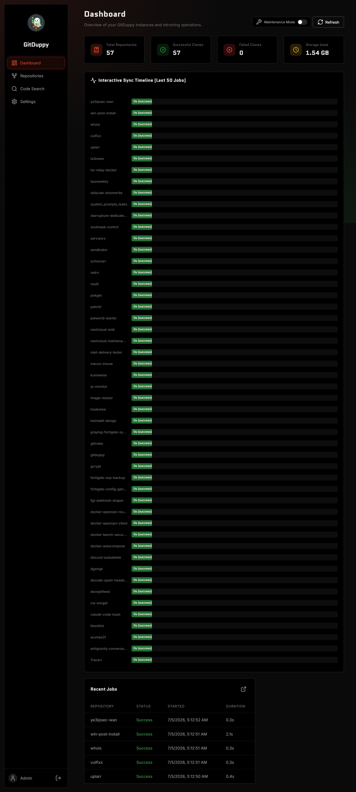
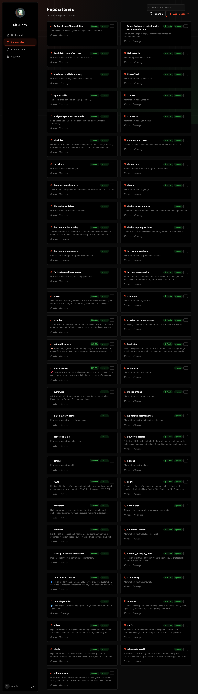
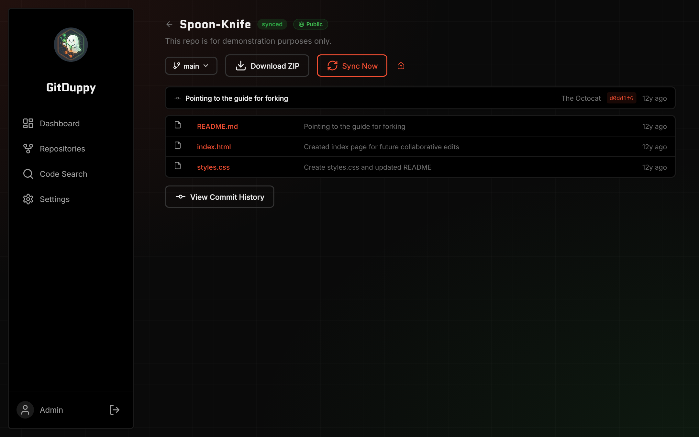
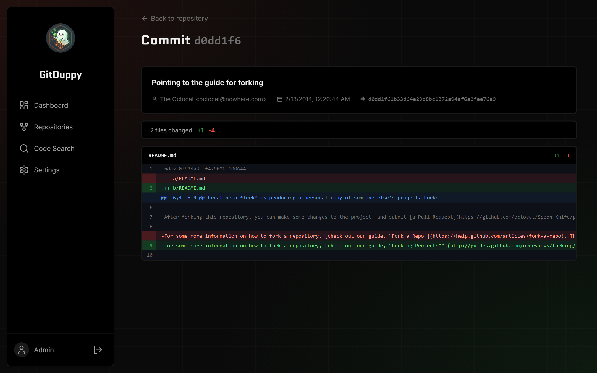
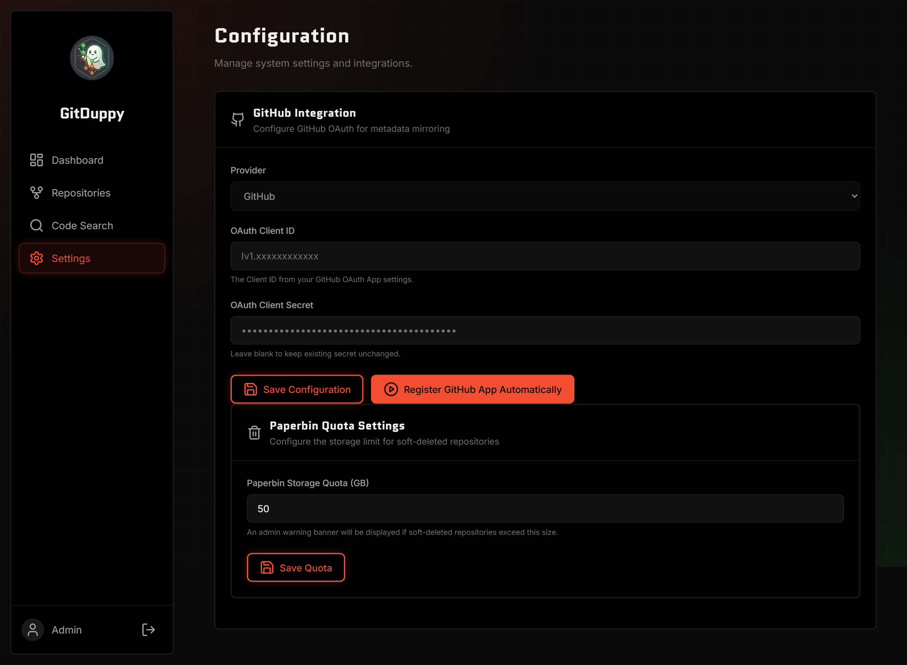
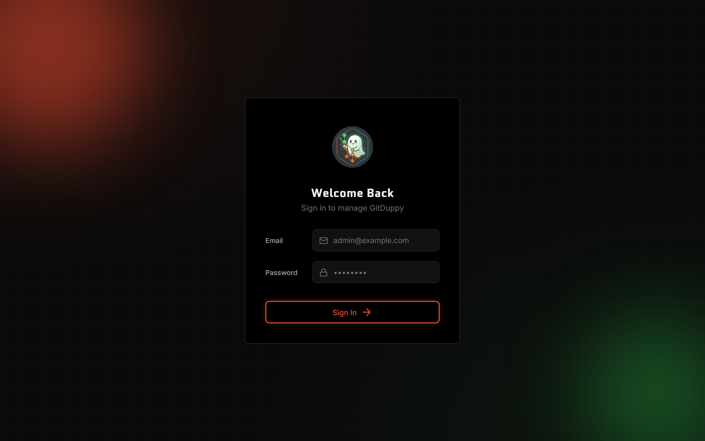

# GitDuppy

<p align="center"></p>

[](https://go.dev)
[](https://github.com/gitduppy/gitduppy/actions)
[](https://golangci-lint.run/)
[](https://github.com/securego/gosec)
[](https://gitleaks.io/)
[](LICENSE)

A modern, secure Git repository mirroring and management platform designed for enterprise environments. GitDuppy provides automated repository synchronization, access control, audit logging, and webhook integrations while maintaining security and compliance standards.

## Features

- Automated Git repository mirroring with configurable schedules
- Full GitHub Metadata Mirroring (Issues, PRs, Releases, and Wikis)
- GitHub-like web repository browser — browse files, commits, diffs in-browser
- Role-based access control (RBAC) with fine-grained permissions
- Comprehensive audit logging for all operations
- Webhook notifications for repository events
- Built-in health monitoring and alerting
- Docker-first deployment with Kubernetes support
- End-to-end encryption for sensitive data
- OAuth2 authentication support
- REST API for programmatic management

## Screenshots

<p align="center"></p>

<p align="center"><em>Dashboard — live sync timeline, aggregate stats, and recent jobs across all mirrored repositories.</em></p>

| Repositories | In‑browser Git browser |
|---|---|
| [](docs/screenshots/02-repos.png) | [](docs/screenshots/05-repo-browse.png) |
| **Commit history** | **Commit diff** |
| [](docs/screenshots/06-commits.png) | [](docs/screenshots/07-commit-diff.png) |
| **Settings** | **Sign in** |
| [](docs/screenshots/04-config.png) | [](docs/screenshots/00-login.png) |

## Quick Start

The easiest way to get started is using Docker Compose:

```bash
# Clone the repository
git clone https://github.com/yourorg/gitduppy.git
cd gitduppy

# Copy the example configuration file
cp config.example.yaml config.yaml

# Start the services
docker compose up -d --build

# Access the dashboard at http://localhost:7659/login (or http://localhost:8080 inside the container)
```

### First-Run Administrator Account

On the first run (when no users exist yet), GitDuppy seeds a single administrator account:
- **Username**: `admin`
- **Email**: `admin@gitmirrors.local`

There is **no universal default password**, and the initial password is **never written to the application logs**. Establish it one of two ways:

1. **Operator-provided secret (recommended):** set the `GITMIRRORS_BOOTSTRAP_ADMIN_PASSWORD` environment variable before the first start. That value becomes the initial admin password, and you already know it out-of-band.
2. **Auto-generated secret:** if the variable is unset, GitDuppy generates a strong random password but does **not** display it. To retrieve it for the very first login, opt in explicitly by also setting `GITMIRRORS_BOOTSTRAP_SHOW_PASSWORD=true`, which prints the generated password **once** at startup. Leave this unset in normal operation.

> [!IMPORTANT]
> Prefer supplying `GITMIRRORS_BOOTSTRAP_ADMIN_PASSWORD` over the one-time display. Log in with the initial password and change it immediately via the change-password flow. The password is stored only as a bcrypt hash, never in plaintext.

---

## Configuration

GitDuppy can be configured via a YAML configuration file (`config.yaml`) or by environment variables. 

All environment variables are prefixed with `GITMIRRORS_` and map to the YAML structure using underscores instead of dots (e.g., `security.master_key` maps to `GITMIRRORS_SECURITY_MASTER_KEY`).

### Core Authentication & Security Configurations

To secure your installation, you must generate three secrets for credential encryption, session signing, and CSRF protection — each a 256-bit key. The **Session Secret** and **CSRF Key** must be **exactly 32 characters long**; the **Master Key** must be either a 32-character string **or** a 64-character hex-encoded value (which decodes to 32 bytes):

1. **Master Key** (`GITMIRRORS_SECURITY_MASTER_KEY` / `security.master_key`): the AES-256 key used to encrypt repository credentials in the database. Accepts either a 32-character string **or** a 64-character hex-encoded key (e.g. `openssl rand -hex 32`).
2. **Session Secret** (`GITMIRRORS_SECURITY_SESSION_SECRET` / `security.session_secret`): a 32-character secret used to sign session cookies.
3. **CSRF Key** (`GITMIRRORS_SECURITY_CSRF_KEY` / `security.csrf_key`): a 32-character key used for CSRF token generation.

#### Generating Keys
Generate a 32-character secret (works for all three keys) with:
- **Bash**: `openssl rand -hex 16`
- **PowerShell**: `-join ((1..16 | % { '{0:x2}' -f (Get-Random -Min 0 -Max 256) }))`

> [!WARNING]
> `openssl rand -hex 32` produces **64** characters. That is accepted for the master key (decoded from hex), but the session and CSRF keys must be exactly 32 characters — use `openssl rand -hex 16` for those.

### OAuth2 Configurations

GitDuppy supports GitHub, GitLab, and Google OAuth2 for user authentication. These can be configured in your `config.yaml` or via env variables:

- **GitHub OAuth**:
  - `GITMIRRORS_OAUTH_GITHUB_CLIENT_ID` / `oauth.github.client_id`
  - `GITMIRRORS_OAUTH_GITHUB_CLIENT_SECRET` / `oauth.github.client_secret`
  - `GITMIRRORS_OAUTH_GITHUB_REDIRECT_URL` (e.g., `http://localhost:7659/api/v1/auth/oauth/github/callback`)
- **GitLab OAuth**:
  - `GITMIRRORS_OAUTH_GITLAB_CLIENT_ID` / `oauth.gitlab.client_id`
  - `GITMIRRORS_OAUTH_GITLAB_CLIENT_SECRET` / `oauth.gitlab.client_secret`
  - `GITMIRRORS_OAUTH_GITLAB_REDIRECT_URL`
- **Google OAuth**:
  - `GITMIRRORS_OAUTH_GOOGLE_CLIENT_ID` / `oauth.google.client_id`
  - `GITMIRRORS_OAUTH_GOOGLE_CLIENT_SECRET` / `oauth.google.client_secret`
  - `GITMIRRORS_OAUTH_GOOGLE_REDIRECT_URL`

### Configuration File
Reference the provided `config.example.yaml` file for complete configuration options. Create a `config.yaml` file in the root directory or specify its path with the `CONFIG_FILE` environment variable.

## Usage

Build and run the server binary:

```bash
go build -o gitduppy ./cmd/server
./gitduppy
```

## API Reference

See the full API documentation in [docs/api-reference.md](docs/api-reference.md).

## Deployment

For production deployments, use the provided Docker Compose files:

- **Development**: `docker-compose.yml`
- **Production**: `docker-compose.prod.yml` with Caddy reverse proxy

The Caddy configuration is located at [deployments/caddy/Caddyfile](deployments/caddy/Caddyfile).

## Security

For comprehensive security guidelines, see [docs/security.md](docs/security.md).

## Web UI

GitDuppy includes a full web interface accessible at `http://localhost:7659` after login.

| Page | URL | Description |
|------|-----|-------------|
| Dashboard | `/dashboard` | Overview of all repositories and recent activity |
| Repository List | `/repos` | Searchable card-grid of all mirrored repositories |
| Repository Browser | `/repos/:id` | Browse files and folders with branch/tag switcher |
| File Viewer | `/repos/:id` (click file) | View file content with syntax highlighting |
| Commit History | `/repos/:id` → View Commit History | Paginated list of commits |
| Commit Detail | `/repos/:id/commit/:sha` | Single commit with full line-by-line diff |
| Settings | `/config` | Application configuration |

## Database migrations

GitDuppy manages its schema in two layers that run in order at startup:

1. **GORM AutoMigrate** owns the *base* tables and columns. It is derived directly
   from the model structs in `internal/models` and creates/updates tables to match
   them on every boot.
2. **goose SQL migrations** (embedded from `internal/database/migrations`) own the
   *constraints, indexes and data fixes* layered on top — CHECK constraints,
   `ON DELETE CASCADE` foreign keys, unique/trigram/hot-path indexes, etc. They run
   right after AutoMigrate via `goose.Up`.

Every migration is written idempotently (`IF NOT EXISTS` / guarded `DO` blocks with
`pg_constraint` lookups, `ADD CONSTRAINT ... NOT VALID`), so it is safe on both fresh
and pre-existing databases and can run on every boot. A migration failure is fatal:
the server refuses to start rather than run with a half-applied schema.

Going forward, add new integrity constraints, indexes and data backfills as a new
numbered file in `internal/database/migrations/` (e.g. `0002_*.sql`) rather than
relying on AutoMigrate.

## Contributing

Contributions are welcome! Please follow these steps:
1. Fork the repository
2. Create a feature branch
3. Write tests for your changes
4. Submit a pull request

## License

GitDuppy is licensed under the MIT License. See [LICENSE](LICENSE) for details.

---

For detailed documentation, see the [docs/](docs/) directory.