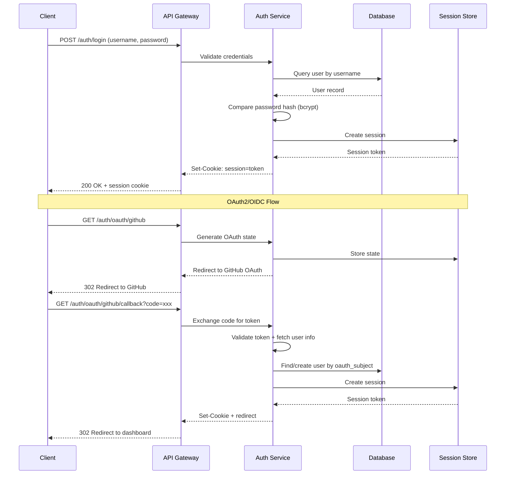
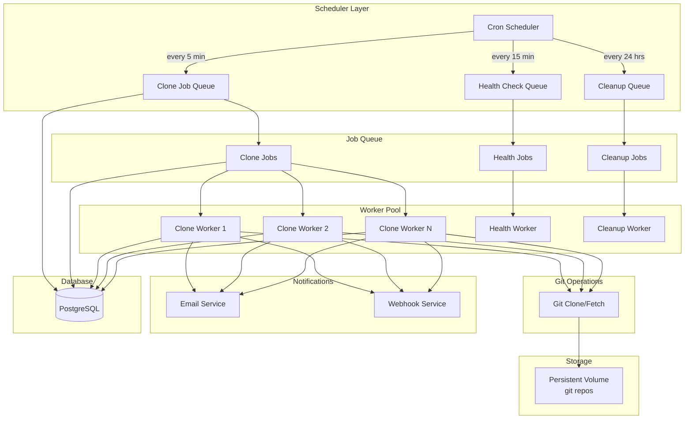
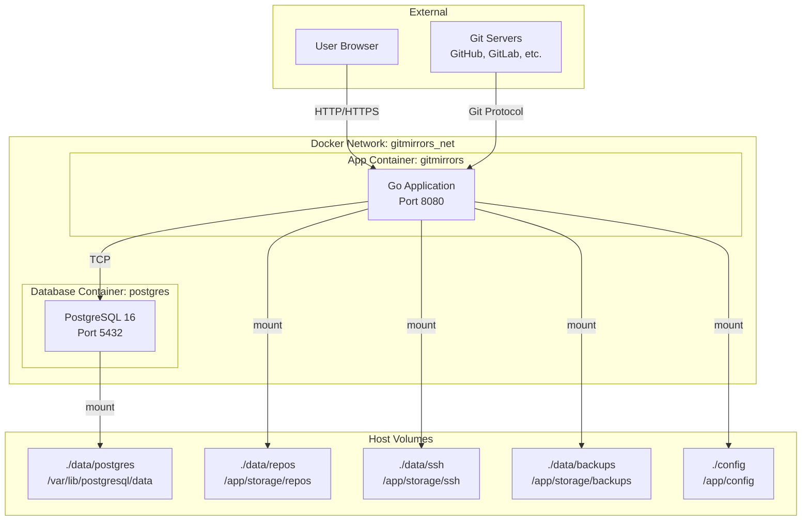
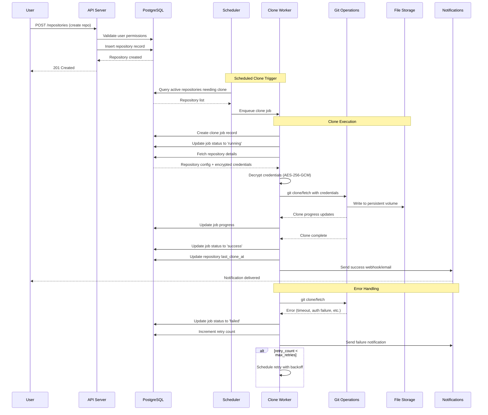
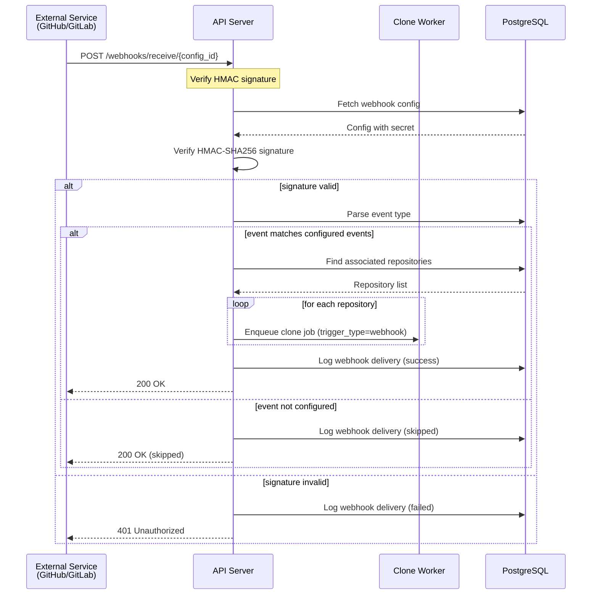
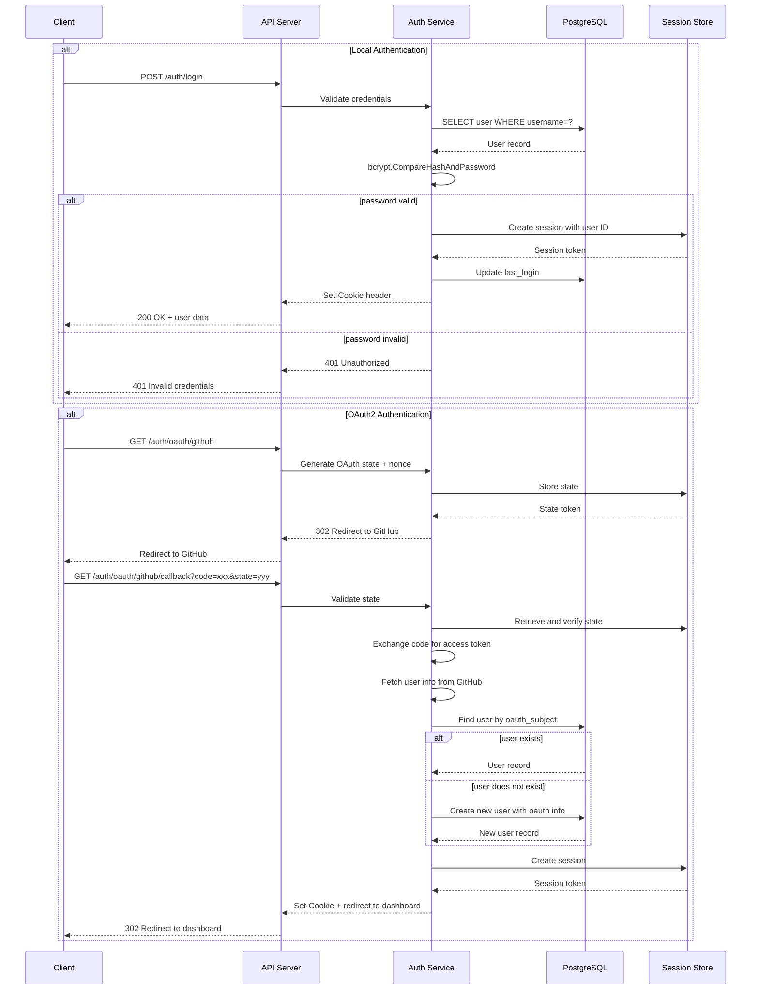

# GitMirrors Go Architecture Document

## Table of Contents
1. [Overview](#1-overview)
2. [Technology Stack](#2-technology-stack)
3. [Project Structure](#3-project-structure)
4. [Database Schema](#4-database-schema)
5. [API Design](#5-api-design)
6. [Security Design](#6-security-design)
7. [Worker Design](#7-worker-design)
8. [Docker Design](#8-docker-design)
9. [Configuration](#9-configuration)
10. [Data Flow Diagrams](#10-data-flow-diagrams)

---

## 1. Overview

GitMirrors is a self-hosted application for managing git repository mirrors. It provides a web interface and REST API for cloning, updating, and monitoring git repositories. The system supports both local user authentication and OAuth2/OIDC providers, stores repositories as full working copies, and handles webhooks both as receiver and sender.

### Core Principles
- **Persistence First**: All data (database, SSH keys, git repos) stored on persistent host volumes
- **Security by Default**: Encrypted credentials, CSRF protection, rate limiting
- **Operational Excellence**: Comprehensive logging, health monitoring, backup support
- **Extensibility**: Modular design for easy feature additions

---

## 2. Technology Stack

### Core Framework & Libraries

| Category | Library | Version | Purpose |
|----------|---------|---------|---------|
| **Web Framework** | `gin-gonic/gin` | v1.9.x | HTTP routing, middleware, JSON handling |
| **Database ORM** | `gorm.io/gorm` | v1.25.x | PostgreSQL ORM with migrations |
| **Database Driver** | `github.com/lib/pq` | v1.10.x | PostgreSQL database driver |
| **Authentication** | `golang.org/x/crypto` | latest | bcrypt password hashing |
| **Session Management** | `github.com/alexedwards/scs` | v2.x | Server-side session management |
| **OAuth2/OIDC** | `golang.org/x/oauth2` + `github.com/coreos/go-oidc` | latest | Third-party authentication |
| **Encryption** | `crypto/aes`, `crypto/cipher` | stdlib | AES-256-GCM credential encryption |
| **Background Jobs** | `robfig/cron` | v3.x | Scheduled job scheduling |
| **Git Operations** | `github.com/go-git/go-git/v5` | v5.x | Git clone, fetch, LFS support |
| **Configuration** | `spf13/viper` | v1.18.x | Config file + env var management |
| **Validation** | `github.com/go-playground/validator` | v10.x | Request payload validation |
| **Logging** | `go.uber.org/zap` | v1.26.x | Structured JSON logging |
| **Metrics** | `prometheus/client_golang` | latest | Health metrics and monitoring |
| **Email** | `github.com/go-mail/mail` | v2.x | SMTP email notifications |
| **HTTP Client** | `net/http` | stdlib | Webhook delivery, health checks |
| **API Key Auth** | `github.com/oklog/ulid` | latest | ULID-based API keys |

### Infrastructure

| Component | Technology | Version |
|-----------|------------|---------|
| **Container Runtime** | Docker | 24.x+ |
| **Orchestration** | Docker Compose | v2.24+ |
| **Database** | PostgreSQL | 16.x |
| **Reverse Proxy (optional)** | Caddy or Nginx | latest |

---

## 3. Project Structure

```
gitmirrors/
├── cmd/
│   └── server/
│       └── main.go                  # Application entry point
├── internal/
│   ├── config/
│   │   ├── config.go                # Configuration structs and loading
│   │   └── default.yaml             # Default configuration values
│   ├── database/
│   │   ├── database.go              # Database connection and initialization
│   │   ├── migrations/
│   │   │   ├── 001_initial_schema.sql
│   │   │   ├── 002_add_users_table.sql
│   │   │   ├── 003_add_api_keys_table.sql
│   │   │   ├── 004_add_webhooks_table.sql
│   │   │   └── 005_add_audit_log_table.sql
│   │   └── seeds/
│   │       └── seed.go              # Initial data seeding
│   ├── models/
│   │   ├── user.go                  # User model
│   │   ├── repository.go            # Repository model
│   │   ├── clone_job.go             # Clone job model
│   │   ├── api_key.go               # API key model
│   │   ├── webhook.go               # Webhook model
│   │   ├── audit_log.go             # Audit log model
│   │   └── tag.go                   # Repository tag model
│   ├── handlers/
│   │   ├── auth.go                  # Authentication handlers
│   │   ├── user.go                  # User CRUD handlers
│   │   ├── repository.go            # Repository CRUD handlers
│   │   ├── clone_job.go             # Clone job handlers
│   │   ├── webhook.go               # Webhook handlers
│   │   ├── dashboard.go             # Dashboard/statistics handlers
│   │   ├── health.go                # Health check handlers
│   │   └── api/
│   │       ├── api_key.go           # API key management
│   │       └── webhook_receiver.go  # Incoming webhook handler
│   ├── middleware/
│   │   ├── auth.go                  # Authentication middleware
│   │   ├── csrf.go                  # CSRF protection middleware
│   │   ├── rate_limiter.go          # Rate limiting middleware
│   │   ├── logging.go               # Request logging middleware
│   │   └── recovery.go              # Panic recovery middleware
│   ├── services/
│   │   ├── auth_service.go          # Authentication business logic
│   │   ├── user_service.go          # User management logic
│   │   ├── repository_service.go    # Repository management logic
│   │   ├── encryption_service.go    # Credential encryption/decryption
│   │   ├── email_service.go         # Email notification logic
│   │   ├── webhook_service.go       # Webhook delivery logic
│   │   ├── backup_service.go        # Backup/export functionality
│   │   └── health_service.go        # External health monitoring
│   ├── worker/
│   │   ├── scheduler.go             # Cron job scheduler
│   │   ├── clone_worker.go          # Clone job processor
│   │   ├── health_worker.go         # Health check worker
│   │   ├── cleanup_worker.go        # Cleanup/orphan worker
│   │   └── pool.go                  # Worker pool management
│   ├── gitops/
│   │   ├── git.go                   # Git operations (clone, fetch, pull)
│   │   ├── lfs.go                   # Git LFS operations
│   │   ├── ssh.go                   # SSH key management
│   │   └── progress.go              # Clone progress tracking
│   └── web/
│       ├── static/
│       │   ├── css/
│       │   │   └── main.css
│       │   ├── js/
│       │   │   ├── app.js
│       │   │   ├── dashboard.js
│       │   │   └── repositories.js
│       │   └── images/
│       ├── templates/
│       │   ├── base.html
│       │   ├── login.html
│       │   ├── dashboard.html
│       │   ├── repositories/
│       │   │   ├── list.html
│       │   │   ├── detail.html
│       │   │   └── form.html
│       │   ├── users/
│       │   │   ├── list.html
│       │   │   └── form.html
│       │   └── partials/
│       │       ├── nav.html
│       │       ├── flash.html
│       │       └── pagination.html
│       └── template_funcs.go        # Custom template functions
├── pkg/
│   ├── response/
│   │   └── response.go              # Standardized API response format
│   ├── errors/
│   │   └── errors.go                # Custom error types
│   └── pagination/
│       └── pagination.go            # Pagination helpers
├── deployments/
│   ├── docker/
│   │   ├── Dockerfile
│   │   ├── docker-compose.yml
│   │   ├── docker-compose.prod.yml
│   │   └── entrypoint.sh
│   └── kubernetes/ (optional)
│       ├── deployment.yaml
│       ├── service.yaml
│       └── pvc.yaml
├── tests/
│   ├── integration/
│   │   ├── auth_test.go
│   │   ├── repository_test.go
│   │   └── worker_test.go
│   ├── unit/
│   │   ├── encryption_test.go
│   │   ├── gitops_test.go
│   │   └── services_test.go
│   └── fixtures/
│       └── test_repos/
├── scripts/
│   ├── backup.sh
│   ├── restore.sh
│   └── generate-keys.sh
├── docs/
│   ├── API.md
│   ├── SECURITY.md
│   └── DEPLOYMENT.md
├── go.mod
├── go.sum
├── Makefile
└── README.md
```

---

## 4. Database Schema

### 4.1 Entity Relationship Diagram

```mermaid
erDiagram
    USERS ||--o{ REPOSITORIES : owns
    USERS ||--o{ API_KEYS : has
    USERS ||--o{ AUDIT_LOGS : creates
    USERS ||--o{ WEBHOOK_CONFIGS : creates
    REPOSITORIES ||--o{ CLONE_JOBS : triggers
    REPOSITORIES ||--o{ REPOSITORY_TAGS : has
    REPOSITORIES ||--o{ AUDIT_LOGS : affects
    TAGS ||--o{ REPOSITORY_TAGS : belongs_to
    CLONE_JOBS ||--o{ CLONE_LOGS : has
    WEBHOOK_CONFIGS ||--o{ WEBHOOK_DELIVERIES : triggers

    USERS {
        uuid id PK
        string username UNIQUE
        string email UNIQUE
        string password_hash
        string role
        boolean is_active
        timestamp last_login
        timestamp created_at
        timestamp updated_at
    }

    REPOSITORIES {
        uuid id PK
        string name
        string url
        string branch
        string auth_type
        text encrypted_credentials
        string storage_path
        string status
        boolean is_bare
        boolean lfs_enabled
        boolean is_active
        int clone_interval_minutes
        text description
        string created_by FK
        timestamp last_clone_at
        timestamp last_clone_status
        timestamp created_at
        timestamp updated_at
    }

    CLONE_JOBS {
        uuid id PK
        uuid repository_id FK
        string trigger_type
        string status
        text output_log
        int exit_code
        timestamp started_at
        timestamp completed_at
        timestamp created_at
    }

    CLONE_LOGS {
        uuid id PK
        uuid clone_job_id FK
        string log_level
        text message
        timestamp created_at
    }

    API_KEYS {
        uuid id PK
        uuid user_id FK
        string key_hash
        string key_prefix
        string name
        boolean is_active
        timestamp expires_at
        timestamp last_used_at
        timestamp created_at
    }

    WEBHOOK_CONFIGS {
        uuid id PK
        uuid user_id FK
        string name
        string url
        string secret
        text events
        boolean is_active
        int retry_count
        timestamp created_at
        timestamp updated_at
    }

    WEBHOOK_DELIVERIES {
        uuid id PK
        uuid webhook_config_id FK
        string event_type
        text payload
        int http_status
        text response_body
        boolean success
        timestamp delivered_at
    }

    AUDIT_LOGS {
        uuid id PK
        uuid user_id FK
        uuid repository_id FK
        string action
        text details
        string ip_address
        string user_agent
        timestamp created_at
    }

    TAGS {
        uuid id PK
        string name UNIQUE
        string color
        timestamp created_at
    }

    REPOSITORY_TAGS {
        uuid id PK
        uuid repository_id FK
        uuid tag_id FK
        timestamp created_at
    }

    SESSIONS {
        string token PK
        uuid user_id FK
        jsonb data
        timestamp expiry
    }

    HEALTH_CHECKS {
        uuid id PK
        string target_url
        string status
        int response_time_ms
        text error_message
        timestamp checked_at
    }
```

### 4.2 Complete SQL Schema

```sql
-- Enable UUID extension
CREATE EXTENSION IF NOT EXISTS "uuid-ossp";

-- Users table
CREATE TABLE users (
    id UUID PRIMARY KEY DEFAULT uuid_generate_v4(),
    username VARCHAR(64) NOT NULL UNIQUE,
    email VARCHAR(255) NOT NULL UNIQUE,
    password_hash VARCHAR(255),  -- NULL for OAuth-only users
    role VARCHAR(20) NOT NULL DEFAULT 'user' CHECK (role IN ('admin', 'user')),
    is_active BOOLEAN NOT NULL DEFAULT true,
    oauth_provider VARCHAR(50),  -- 'github', 'gitlab', 'google', etc.
    oauth_subject VARCHAR(255),  -- External user identifier
    last_login TIMESTAMP WITH TIME ZONE,
    created_at TIMESTAMP WITH TIME ZONE NOT NULL DEFAULT NOW(),
    updated_at TIMESTAMP WITH TIME ZONE NOT NULL DEFAULT NOW()
);

-- Repositories table
CREATE TABLE repositories (
    id UUID PRIMARY KEY DEFAULT uuid_generate_v4(),
    name VARCHAR(255) NOT NULL,
    url VARCHAR(2048) NOT NULL,
    branch VARCHAR(255) DEFAULT 'main',
    auth_type VARCHAR(20) NOT NULL DEFAULT 'none' CHECK (auth_type IN ('none', 'https', 'ssh', 'token')),
    encrypted_credentials TEXT,  -- AES-256-GCM encrypted JSON
    storage_path VARCHAR(1024) NOT NULL,  -- Relative to base storage path
    status VARCHAR(20) NOT NULL DEFAULT 'pending' CHECK (status IN ('pending', 'cloning', 'success', 'failed', 'updating')),
    is_bare BOOLEAN NOT NULL DEFAULT false,
    lfs_enabled BOOLEAN NOT NULL DEFAULT false,
    is_active BOOLEAN NOT NULL DEFAULT true,
    clone_interval_minutes INTEGER NOT NULL DEFAULT 60 CHECK (clone_interval_minutes >= 5),
    description TEXT,
    created_by UUID REFERENCES users(id) ON DELETE SET NULL,
    last_clone_at TIMESTAMP WITH TIME ZONE,
    last_clone_status VARCHAR(20),
    retry_count INTEGER NOT NULL DEFAULT 0,
    max_retries INTEGER NOT NULL DEFAULT 3,
    created_at TIMESTAMP WITH TIME ZONE NOT NULL DEFAULT NOW(),
    updated_at TIMESTAMP WITH TIME ZONE NOT NULL DEFAULT NOW()
);

-- Clone jobs table
CREATE TABLE clone_jobs (
    id UUID PRIMARY KEY DEFAULT uuid_generate_v4(),
    repository_id UUID NOT NULL REFERENCES repositories(id) ON DELETE CASCADE,
    trigger_type VARCHAR(20) NOT NULL CHECK (trigger_type IN ('scheduled', 'manual', 'webhook', 'api')),
    status VARCHAR(20) NOT NULL DEFAULT 'pending' CHECK (status IN ('pending', 'running', 'success', 'failed', 'cancelled')),
    output_log TEXT,
    exit_code INTEGER,
    progress_percent INTEGER DEFAULT 0 CHECK (progress_percent >= 0 AND progress_percent <= 100),
    started_at TIMESTAMP WITH TIME ZONE,
    completed_at TIMESTAMP WITH TIME ZONE,
    created_at TIMESTAMP WITH TIME ZONE NOT NULL DEFAULT NOW()
);

-- Clone logs table (detailed per-job logs)
CREATE TABLE clone_logs (
    id UUID PRIMARY KEY DEFAULT uuid_generate_v4(),
    clone_job_id UUID NOT NULL REFERENCES clone_jobs(id) ON DELETE CASCADE,
    log_level VARCHAR(10) NOT NULL CHECK (log_level IN ('DEBUG', 'INFO', 'WARN', 'ERROR')),
    message TEXT NOT NULL,
    created_at TIMESTAMP WITH TIME ZONE NOT NULL DEFAULT NOW()
);

-- API keys table
CREATE TABLE api_keys (
    id UUID PRIMARY KEY DEFAULT uuid_generate_v4(),
    user_id UUID NOT NULL REFERENCES users(id) ON DELETE CASCADE,
    key_hash VARCHAR(64) NOT NULL,  -- SHA-256 hash of the API key
    key_prefix VARCHAR(8) NOT NULL,  -- First 8 chars for display
    name VARCHAR(100) NOT NULL,
    is_active BOOLEAN NOT NULL DEFAULT true,
    expires_at TIMESTAMP WITH TIME ZONE,
    last_used_at TIMESTAMP WITH TIME ZONE,
    created_at TIMESTAMP WITH TIME ZONE NOT NULL DEFAULT NOW(),
    UNIQUE(user_id, name)
);

-- Webhook configurations table
CREATE TABLE webhook_configs (
    id UUID PRIMARY KEY DEFAULT uuid_generate_v4(),
    user_id UUID NOT NULL REFERENCES users(id) ON DELETE CASCADE,
    name VARCHAR(100) NOT NULL,
    url VARCHAR(2048) NOT NULL,
    secret VARCHAR(255),  -- HMAC secret for webhook signatures
    events JSONB NOT NULL DEFAULT '[]'::jsonb,  -- ['repo.clone.success', 'repo.clone.failed', ...]
    is_active BOOLEAN NOT NULL DEFAULT true,
    retry_count INTEGER NOT NULL DEFAULT 3,
    timeout_seconds INTEGER NOT NULL DEFAULT 30,
    created_at TIMESTAMP WITH TIME ZONE NOT NULL DEFAULT NOW(),
    updated_at TIMESTAMP WITH TIME ZONE NOT NULL DEFAULT NOW()
);

-- Webhook deliveries table
CREATE TABLE webhook_deliveries (
    id UUID PRIMARY KEY DEFAULT uuid_generate_v4(),
    webhook_config_id UUID NOT NULL REFERENCES webhook_configs(id) ON DELETE CASCADE,
    event_type VARCHAR(100) NOT NULL,
    payload JSONB NOT NULL,
    http_status INTEGER,
    response_body TEXT,
    success BOOLEAN NOT NULL DEFAULT false,
    attempt_number INTEGER NOT NULL DEFAULT 1,
    delivered_at TIMESTAMP WITH TIME ZONE NOT NULL DEFAULT NOW()
);

-- Audit logs table
CREATE TABLE audit_logs (
    id UUID PRIMARY KEY DEFAULT uuid_generate_v4(),
    user_id UUID REFERENCES users(id) ON DELETE SET NULL,
    repository_id UUID REFERENCES repositories(id) ON DELETE SET NULL,
    action VARCHAR(100) NOT NULL,  -- 'user.login', 'repo.create', 'repo.delete', 'job.trigger', etc.
    details JSONB,
    ip_address INET,
    user_agent TEXT,
    created_at TIMESTAMP WITH TIME ZONE NOT NULL DEFAULT NOW()
);

-- Tags table
CREATE TABLE tags (
    id UUID PRIMARY KEY DEFAULT uuid_generate_v4(),
    name VARCHAR(50) NOT NULL UNIQUE,
    color VARCHAR(7) DEFAULT '#6366f1',  -- Hex color code
    created_at TIMESTAMP WITH TIME ZONE NOT NULL DEFAULT NOW()
);

-- Repository-Tag junction table
CREATE TABLE repository_tags (
    id UUID PRIMARY KEY DEFAULT uuid_generate_v4(),
    repository_id UUID NOT NULL REFERENCES repositories(id) ON DELETE CASCADE,
    tag_id UUID NOT NULL REFERENCES tags(id) ON DELETE CASCADE,
    created_at TIMESTAMP WITH TIME ZONE NOT NULL DEFAULT NOW(),
    UNIQUE(repository_id, tag_id)
);

-- Sessions table (for alexedwards/scs)
CREATE TABLE sessions (
    token VARCHAR(43) PRIMARY KEY,
    user_id UUID NOT NULL REFERENCES users(id) ON DELETE CASCADE,
    data JSONB NOT NULL,
    expiry TIMESTAMP WITH TIME ZONE NOT NULL
);

-- Health checks table
CREATE TABLE health_checks (
    id UUID PRIMARY KEY DEFAULT uuid_generate_v4(),
    target_url VARCHAR(2048) NOT NULL,
    status VARCHAR(20) NOT NULL CHECK (status IN ('healthy', 'unhealthy', 'unknown')),
    response_time_ms INTEGER,
    error_message TEXT,
    checked_at TIMESTAMP WITH TIME ZONE NOT NULL DEFAULT NOW()
);

-- ============================================================
-- INDEXES
-- ============================================================

-- Users indexes
CREATE INDEX idx_users_username ON users(username);
CREATE INDEX idx_users_email ON users(email);
CREATE INDEX idx_users_role ON users(role);
CREATE INDEX idx_users_oauth ON users(oauth_provider, oauth_subject);

-- Repositories indexes
CREATE INDEX idx_repositories_name ON repositories(name);
CREATE INDEX idx_repositories_status ON repositories(status);
CREATE INDEX idx_repositories_created_by ON repositories(created_by);
CREATE INDEX idx_repositories_is_active ON repositories(is_active);
CREATE INDEX idx_repositories_last_clone ON repositories(last_clone_at);
CREATE INDEX idx_repositories_storage_path ON repositories(storage_path);

-- Clone jobs indexes
CREATE INDEX idx_clone_jobs_repository_id ON clone_jobs(repository_id);
CREATE INDEX idx_clone_jobs_status ON clone_jobs(status);
CREATE INDEX idx_clone_jobs_trigger_type ON clone_jobs(trigger_type);
CREATE INDEX idx_clone_jobs_created_at ON clone_jobs(created_at);

-- Clone logs indexes
CREATE INDEX idx_clone_logs_clone_job_id ON clone_logs(clone_job_id);
CREATE INDEX idx_clone_logs_created_at ON clone_logs(created_at);

-- API keys indexes
CREATE INDEX idx_api_keys_user_id ON api_keys(user_id);
CREATE INDEX idx_api_keys_key_hash ON api_keys(key_hash);
CREATE INDEX idx_api_keys_is_active ON api_keys(is_active);

-- Webhook indexes
CREATE INDEX idx_webhook_configs_user_id ON webhook_configs(user_id);
CREATE INDEX idx_webhook_configs_is_active ON webhook_configs(is_active);
CREATE INDEX idx_webhook_deliveries_config_id ON webhook_deliveries(webhook_config_id);
CREATE INDEX idx_webhook_deliveries_event_type ON webhook_deliveries(event_type);
CREATE INDEX idx_webhook_deliveries_delivered_at ON webhook_deliveries(delivered_at);

-- Audit log indexes
CREATE INDEX idx_audit_logs_user_id ON audit_logs(user_id);
CREATE INDEX idx_audit_logs_repository_id ON audit_logs(repository_id);
CREATE INDEX idx_audit_logs_action ON audit_logs(action);
CREATE INDEX idx_audit_logs_created_at ON audit_logs(created_at);

-- Repository tags indexes
CREATE INDEX idx_repository_tags_repo_id ON repository_tags(repository_id);
CREATE INDEX idx_repository_tags_tag_id ON repository_tags(tag_id);

-- Sessions indexes
CREATE INDEX idx_sessions_user_id ON sessions(user_id);
CREATE INDEX idx_sessions_expiry ON sessions(expiry);

-- Health checks indexes
CREATE INDEX idx_health_checks_target ON health_checks(target_url);
CREATE INDEX idx_health_checks_checked_at ON health_checks(checked_at);

-- ============================================================
-- TRIGGERS (auto-update updated_at)
-- ============================================================

CREATE OR REPLACE FUNCTION update_updated_at_column()
RETURNS TRIGGER AS $$
BEGIN
    NEW.updated_at = NOW();
    RETURN NEW;
END;
$$ LANGUAGE plpgsql;

CREATE TRIGGER update_users_updated_at BEFORE UPDATE ON users
    FOR EACH ROW EXECUTE FUNCTION update_updated_at_column();

CREATE TRIGGER update_repositories_updated_at BEFORE UPDATE ON repositories
    FOR EACH ROW EXECUTE FUNCTION update_updated_at_column();

CREATE TRIGGER update_webhook_configs_updated_at BEFORE UPDATE ON webhook_configs
    FOR EACH ROW EXECUTE FUNCTION update_updated_at_column();

-- ============================================================
-- VIEWS
-- ============================================================

-- Repository summary view
CREATE OR REPLACE VIEW repository_summary AS
SELECT
    r.id,
    r.name,
    r.url,
    r.branch,
    r.status,
    r.is_active,
    r.lfs_enabled,
    r.clone_interval_minutes,
    r.description,
    r.last_clone_at,
    r.last_clone_status,
    r.retry_count,
    u.username AS created_by_username,
    COUNT(DISTINCT cj.id) AS total_clone_jobs,
    COUNT(DISTINCT cj.id) FILTER (WHERE cj.status = 'success') AS successful_clones,
    COUNT(DISTINCT cj.id) FILTER (WHERE cj.status = 'failed') AS failed_clones,
    ARRAY_AGG(DISTINCT t.name) FILTER (WHERE t.name IS NOT NULL) AS tags
FROM repositories r
LEFT JOIN users u ON r.created_by = u.id
LEFT JOIN clone_jobs cj ON r.id = cj.repository_id
LEFT JOIN repository_tags rt ON r.id = rt.repository_id
LEFT JOIN tags t ON rt.tag_id = t.id
GROUP BY r.id, u.username;

-- ============================================================
-- SEED DATA
-- ============================================================

-- Default admin user (password: admin123 - must be changed on first login)
INSERT INTO users (username, email, password_hash, role) VALUES
('admin', 'admin@gitmirrors.local', '$2a$12$LQv3c1yqBWVHjkd6Kjb0Le', 'admin');

-- Default tags
INSERT INTO tags (name, color) VALUES
('production', '#ef4444'),
('staging', '#f59e0b'),
('development', '#22c55e'),
('archived', '#6b7280');

```

---

## 5. API Design

### 5.1 API Conventions

- **Base URL**: `/api/v1`
- **Authentication**: Bearer token (API key) or session cookie
- **Content-Type**: `application/json`
- **Response Format**: Standardized envelope

#### Standard Response Envelope

```json
{
    "success": true,
    "data": {},
    "meta": {
        "page": 1,
        "per_page": 20,
        "total": 100,
        "total_pages": 5
    },
    "errors": []
}
```

#### Error Response

```json
{
    "success": false,
    "data": null,
    "errors": [
        {
            "code": "VALIDATION_ERROR",
            "message": "Repository name is required",
            "field": "name"
        }
    ]
}
```

### 5.2 Complete API Endpoints

#### Authentication Endpoints

| Method | Path | Description | Auth Required |
|--------|------|-------------|---------------|
| `POST` | `/api/v1/auth/login` | Login with username/password | No |
| `POST` | `/api/v1/auth/logout` | Logout current session | Yes (session) |
| `GET` | `/api/v1/auth/me` | Get current user info | Yes |
| `GET` | `/api/v1/auth/oauth/{provider}` | Initiate OAuth flow | No |
| `GET` | `/api/v1/auth/oauth/{provider}/callback` | OAuth callback | No |
| `POST` | `/api/v1/auth/refresh` | Refresh session | Yes (session) |
| `POST` | `/api/v1/auth/change-password` | Change password | Yes (session) |

**POST /api/v1/auth/login**
```json
// Request
{
    "username": "admin",
    "password": "secret123",
    "remember_me": true
}

// Response (200 OK)
{
    "success": true,
    "data": {
        "user": {
            "id": "550e8400-e29b-41d4-a716-446655440000",
            "username": "admin",
            "email": "admin@gitmirrors.local",
            "role": "admin"
        },
        "session_expires_at": "2024-01-16T19:21:00Z"
    }
}
```

#### User Management Endpoints

| Method | Path | Description | Auth Required | Role |
|--------|------|-------------|---------------|------|
| `GET` | `/api/v1/users` | List all users (paginated) | Yes | admin |
| `GET` | `/api/v1/users/{id}` | Get user by ID | Yes | admin |
| `POST` | `/api/v1/users` | Create new user | Yes | admin |
| `PUT` | `/api/v1/users/{id}` | Update user | Yes | admin |
| `DELETE` | `/api/v1/users/{id}` | Delete user | Yes | admin |
| `PATCH` | `/api/v1/users/{id}/status` | Enable/disable user | Yes | admin |

**GET /api/v1/users**
```json
// Query params: ?page=1&per_page=20&role=admin&is_active=true
// Response (200 OK)
{
    "success": true,
    "data": [
        {
            "id": "550e8400-e29b-41d4-a716-446655440000",
            "username": "admin",
            "email": "admin@gitmirrors.local",
            "role": "admin",
            "is_active": true,
            "oauth_provider": null,
            "last_login": "2024-01-15T10:30:00Z",
            "created_at": "2024-01-01T00:00:00Z"
        }
    ],
    "meta": {
        "page": 1,
        "per_page": 20,
        "total": 1,
        "total_pages": 1
    }
}
```

**POST /api/v1/users**
```json
// Request
{
    "username": "developer1",
    "email": "dev1@example.com",
    "password": "securePass123!",
    "role": "user"
}

// Response (201 Created)
{
    "success": true,
    "data": {
        "id": "550e8400-e29b-41d4-a716-446655440001",
        "username": "developer1",
        "email": "dev1@example.com",
        "role": "user",
        "is_active": true,
        "created_at": "2024-01-15T10:30:00Z"
    }
}
```

#### Repository Endpoints

| Method | Path | Description | Auth Required |
|--------|------|-------------|---------------|
| `GET` | `/api/v1/repositories` | List repositories (paginated, filterable) | Yes |
| `GET` | `/api/v1/repositories/{id}` | Get repository details | Yes |
| `POST` | `/api/v1/repositories` | Create new repository | Yes |
| `PUT` | `/api/v1/repositories/{id}` | Update repository | Yes |
| `DELETE` | `/api/v1/repositories/{id}` | Delete repository | Yes |
| `PATCH` | `/api/v1/repositories/{id}/status` | Enable/disable repository | Yes |
| `POST` | `/api/v1/repositories/{id}/clone` | Manually trigger clone | Yes |
| `GET` | `/api/v1/repositories/{id}/jobs` | List clone jobs for repo | Yes |
| `GET` | `/api/v1/repositories/{id}/logs` | Get repository clone logs | Yes |

**GET /api/v1/repositories**
```json
// Query params: ?page=1&per_page=20&status=success&tag=production&search=frontend&sort=-last_clone_at
// Response (200 OK)
{
    "success": true,
    "data": [
        {
            "id": "550e8400-e29b-41d4-a716-446655440010",
            "name": "my-app",
            "url": "https://github.com/org/my-app.git",
            "branch": "main",
            "auth_type": "token",
            "storage_path": "github/org/my-app",
            "status": "success",
            "is_bare": false,
            "lfs_enabled": true,
            "is_active": true,
            "clone_interval_minutes": 30,
            "description": "Main application repository",
            "created_by": "550e8400-e29b-41d4-a716-446655440000",
            "last_clone_at": "2024-01-15T10:00:00Z",
            "last_clone_status": "success",
            "tags": ["production", "frontend"],
            "created_at": "2024-01-01T00:00:00Z",
            "updated_at": "2024-01-15T10:00:00Z"
        }
    ],
    "meta": {
        "page": 1,
        "per_page": 20,
        "total": 42,
        "total_pages": 3
    }
}
```

**POST /api/v1/repositories**
```json
// Request
{
    "name": "my-app",
    "url": "https://github.com/org/my-app.git",
    "branch": "main",
    "auth_type": "token",
    "credentials": {
        "token": "ghp_xxxxxxxxxxxxxxxxxxxx"
    },
    "storage_path": "github/org/my-app",
    "is_bare": false,
    "lfs_enabled": true,
    "clone_interval_minutes": 30,
    "description": "Main application repository",
    "tag_ids": ["550e8400-e29b-41d4-a716-446655440020"]
}

// Response (201 Created)
{
    "success": true,
    "data": {
        "id": "550e8400-e29b-41d4-a716-446655440010",
        "name": "my-app",
        "status": "pending",
        "created_at": "2024-01-15T10:30:00Z"
    }
}
```

**POST /api/v1/repositories/{id}/clone**
```json
// Request (empty body)
// Response (202 Accepted)
{
    "success": true,
    "data": {
        "job_id": "550e8400-e29b-41d4-a716-446655440030",
        "status": "pending",
        "message": "Clone job queued"
    }
}
```

#### Clone Job Endpoints

| Method | Path | Description | Auth Required |
|--------|------|-------------|---------------|
| `GET` | `/api/v1/jobs` | List all clone jobs (paginated) | Yes |
| `GET` | `/api/v1/jobs/{id}` | Get job details with logs | Yes |
| `GET` | `/api/v1/jobs/{id}/logs` | Get job-specific logs | Yes |
| `POST` | `/api/v1/jobs/{id}/cancel` | Cancel a running job | Yes |

**GET /api/v1/jobs/{id}**
```json
// Response (200 OK)
{
    "success": true,
    "data": {
        "id": "550e8400-e29b-41d4-a716-446655440030",
        "repository_id": "550e8400-e29b-41d4-a716-446655440010",
        "repository_name": "my-app",
        "trigger_type": "manual",
        "status": "running",
        "progress_percent": 65,
        "output_log": "Cloning into 'my-app'...\nReceiving objects: 65% (130/200)",
        "started_at": "2024-01-15T10:30:00Z",
        "completed_at": null,
        "created_at": "2024-01-15T10:30:00Z"
    }
}
```

#### API Key Endpoints

| Method | Path | Description | Auth Required |
|--------|------|-------------|---------------|
| `GET` | `/api/v1/api-keys` | List user's API keys | Yes |
| `POST` | `/api/v1/api-keys` | Create new API key | Yes |
| `DELETE` | `/api/v1/api-keys/{id}` | Revoke API key | Yes |

**POST /api/v1/api-keys**
```json
// Request
{
    "name": "CI/CD Pipeline Key",
    "expires_in_days": 90
}

// Response (201 Created)
{
    "success": true,
    "data": {
        "id": "550e8400-e29b-41d4-a716-446655440040",
        "name": "CI/CD Pipeline Key",
        "key": "gm_abc123def456ghi789jkl012mno345pqr678stu901vwx234",
        "key_prefix": "gm_abc123d",
        "expires_at": "2024-04-15T10:30:00Z",
        "created_at": "2024-01-15T10:30:00Z"
    },
    "warning": "Store this key securely. It will not be shown again."
}
```

#### Webhook Endpoints

| Method | Path | Description | Auth Required |
|--------|------|-------------|---------------|
| `GET` | `/api/v1/webhooks` | List webhook configs | Yes |
| `POST` | `/api/v1/webhooks` | Create webhook config | Yes |
| `GET` | `/api/v1/webhooks/{id}` | Get webhook config | Yes |
| `PUT` | `/api/v1/webhooks/{id}` | Update webhook config | Yes |
| `DELETE` | `/api/v1/webhooks/{id}` | Delete webhook config | Yes |
| `GET` | `/api/v1/webhooks/{id}/deliveries` | List webhook deliveries | Yes |
| `POST` | `/api/v1/webhooks/{id}/test` | Test webhook delivery | Yes |

**Incoming Webhook Receiver** (no auth required, uses HMAC signature)

| Method | Path | Description | Auth Required |
|--------|------|-------------|---------------|
| `POST` | `/api/v1/webhooks/receive/{config_id}` | Receive external webhook | HMAC signature |

**POST /api/v1/webhooks**
```json
// Request
{
    "name": "Slack Notifications",
    "url": "https://hooks.slack.com/services/T00/B00/xxx",
    "secret": "webhook_secret_here",
    "events": ["repo.clone.success", "repo.clone.failed"],
    "is_active": true,
    "retry_count": 3,
    "timeout_seconds": 30
}

// Response (201 Created)
{
    "success": true,
    "data": {
        "id": "550e8400-e29b-41d4-a716-446655440050",
        "name": "Slack Notifications",
        "url": "https://hooks.slack.com/services/T00/B00/xxx",
        "events": ["repo.clone.success", "repo.clone.failed"],
        "is_active": true,
        "created_at": "2024-01-15T10:30:00Z"
    }
}
```

#### Dashboard/Statistics Endpoints

| Method | Path | Description | Auth Required |
|--------|------|-------------|---------------|
| `GET` | `/api/v1/dashboard/stats` | Get dashboard statistics | Yes |
| `GET` | `/api/v1/dashboard/clone-chart` | Clone success/failure chart data | Yes |
| `GET` | `/api/v1/dashboard/recent-jobs` | Recent clone jobs | Yes |

**GET /api/v1/dashboard/stats**
```json
// Response (200 OK)
{
    "success": true,
    "data": {
        "total_repositories": 42,
        "active_repositories": 38,
        "failed_repositories": 3,
        "total_clone_jobs": 1523,
        "success_rate": 94.5,
        "average_clone_duration_seconds": 45.2,
        "total_storage_bytes": 5368709120,
        "recent_activity": {
            "clones_last_24h": 156,
            "failures_last_24h": 3
        }
    }
}
```

#### Health Check Endpoints

| Method | Path | Description | Auth Required |
|--------|------|-------------|---------------|
| `GET` | `/api/v1/health` | Basic health check | No |
| `GET` | `/api/v1/health/ready` | Readiness probe | No |
| `GET` | `/api/v1/health/live` | Liveness probe | No |
| `GET` | `/api/v1/health/git-servers` | External git server health | Yes |
| `GET` | `/metrics` | Prometheus metrics | No (typically internal) |

**GET /api/v1/health**
```json
// Response (200 OK)
{
    "success": true,
    "data": {
        "status": "healthy",
        "version": "1.0.0",
        "uptime_seconds": 86400,
        "database": "connected",
        "storage": "accessible",
        "workers": {
            "active": 2,
            "idle": 3,
            "queue_size": 0
        }
    }
}
```

#### Tag Endpoints

| Method | Path | Description | Auth Required |
|--------|------|-------------|---------------|
| `GET` | `/api/v1/tags` | List all tags | Yes |
| `POST` | `/api/v1/tags` | Create tag | Yes (admin) |
| `PUT` | `/api/v1/tags/{id}` | Update tag | Yes (admin) |
| `DELETE` | `/api/v1/tags/{id}` | Delete tag | Yes (admin) |

#### Backup Endpoints

| Method | Path | Description | Auth Required |
|--------|------|-------------|---------------|
| `POST` | `/api/v1/backup/export` | Export database + config | Yes (admin) |
| `POST` | `/api/v1/backup/import` | Import backup | Yes (admin) |

---

## 6. Security Design

### 6.1 Authentication Architecture



### 6.2 Password Security

```go
// Password hashing using bcrypt
type PasswordService struct{}

func (s *PasswordService) Hash(password string) (string, error) {
    bytes, err := bcrypt.GenerateFromPassword([]byte(password), bcrypt.DefaultCost)
    return string(bytes), err
}

func (s *PasswordService) Compare(hash, password string) error {
    return bcrypt.CompareHashAndPassword([]byte(hash), []byte(password))
}
```

### 6.3 Credential Encryption (AES-256-GCM)

```go
// Encryption service for repository credentials
type EncryptionService struct {
    masterKey [32]byte // 256-bit key from environment
}

func NewEncryptionService(masterKey string) (*EncryptionService, error) {
    if len(masterKey) != 32 {
        return nil, errors.New("master key must be exactly 32 bytes")
    }
    var key [32]byte
    copy(key[:], []byte(masterKey))
    return &EncryptionService{masterKey: key}, nil
}

// CredentialsPayload represents the structure stored in encrypted field
type CredentialsPayload struct {
    Username string `json:"username,omitempty"`
    Password string `json:"password,omitempty"`
    Token    string `json:"token,omitempty"`
    SSHKey   string `json:"ssh_key,omitempty"` // PEM-encoded private key
}

func (s *EncryptionService) Encrypt(payload CredentialsPayload) (string, error) {
    plaintext, err := json.Marshal(payload)
    if err != nil {
        return "", err
    }

    block, err := aes.NewCipher(s.masterKey[:])
    if err != nil {
        return "", err
    }

    gcm, err := cipher.NewGCM(block)
    if err != nil {
        return "", err
    }

    nonce := make([]byte, gcm.NonceSize())
    if _, err := io.ReadFull(rand.Reader, nonce); err != nil {
        return "", err
    }

    ciphertext := gcm.Seal(nonce, nonce, plaintext, nil)
    return base64.StdEncoding.EncodeToString(ciphertext), nil
}

func (s *EncryptionService) Decrypt(encrypted string) (CredentialsPayload, error) {
    ciphertext, err := base64.StdEncoding.DecodeString(encrypted)
    if err != nil {
        return CredentialsPayload{}, err
    }

    block, err := aes.NewCipher(s.masterKey[:])
    if err != nil {
        return CredentialsPayload{}, err
    }

    gcm, err := cipher.NewGCM(block)
    if err != nil {
        return CredentialsPayload{}, err
    }

    nonceSize := gcm.NonceSize()
    if len(ciphertext) < nonceSize {
        return CredentialsPayload{}, errors.New("ciphertext too short")
    }

    nonce, ciphertext := ciphertext[:nonceSize], ciphertext[nonceSize:]
    plaintext, err := gcm.Open(nil, nonce, ciphertext, nil)
    if err != nil {
        return CredentialsPayload{}, err
    }

    var payload CredentialsPayload
    err = json.Unmarshal(plaintext, &payload)
    return payload, err
}
```

### 6.4 API Key Authentication

```go
// API key generation and validation
type APIKeyService struct {
    db *gorm.DB
}

type APIKey struct {
    ID        uuid.UUID `gorm:"type:uuid;primaryKey"`
    UserID    uuid.UUID `gorm:"type:uuid;not null"`
    KeyHash   string    `gorm:"size:64;not null;index"`
    KeyPrefix string    `gorm:"size:8;not null"`
    Name      string    `gorm:"size:100;not null"`
    IsActive  bool      `gorm:"default:true"`
    ExpiresAt *time.Time
    LastUsedAt *time.Time
    CreatedAt time.Time
}

// GenerateAPIKey creates a new API key and returns the plaintext key
func (s *APIKeyService) GenerateAPIKey(userID uuid.UUID, name string, expiresInDays int) (string, *APIKey, error) {
    // Generate random key
    keyBytes := make([]byte, 32)
    if _, err := rand.Read(keyBytes); err != nil {
        return "", nil, err
    }
    key := "gm_" + base64.RawURLEncoding.EncodeToString(keyBytes)

    // Hash the key for storage
    hash := sha256.Sum256([]byte(key))
    keyHash := hex.EncodeToString(hash[:])
    keyPrefix := key[:8]

    var expiresAt *time.Time
    if expiresInDays > 0 {
        exp := time.Now().Add(time.Duration(expiresInDays) * 24 * time.Hour)
        expiresAt = &exp
    }

    apiKey := &APIKey{
        ID:        uuid.New(),
        UserID:    userID,
        KeyHash:   keyHash,
        KeyPrefix: keyPrefix,
        Name:      name,
        ExpiresAt: expiresAt,
        CreatedAt: time.Now(),
    }

    if err := s.db.Create(apiKey).Error; err != nil {
        return "", nil, err
    }

    return key, apiKey, nil
}

// ValidateAPIKey checks if an API key is valid
func (s *APIKeyService) ValidateAPIKey(key string) (*User, error) {
    hash := sha256.Sum256([]byte(key))
    keyHash := hex.EncodeToString(hash[:])

    var apiKey APIKey
    if err := s.db.Where("key_hash = ? AND is_active = true", keyHash).First(&apiKey).Error; err != nil {
        return nil, errors.New("invalid API key")
    }

    if apiKey.ExpiresAt != nil && time.Now().After(*apiKey.ExpiresAt) {
        return nil, errors.New("API key expired")
    }

    // Update last used
    s.db.Model(&apiKey).Update("last_used_at", time.Now())

    var user User
    if err := s.db.First(&user, apiKey.UserID).Error; err != nil {
        return nil, err
    }

    return &user, nil
}
```

### 6.5 CSRF Protection

```go
// CSRF middleware using gorilla/csrf
type CSRFMiddleware struct {
    store *csrf.CSRF
}

func NewCSRFMiddleware(authKey []byte) *CSRFMiddleware {
    return &CSRFMiddleware{
        store: csrf.Protect(
            authKey,
            csrf.Secure(false), // Set true in production with HTTPS
            csrf.SameSite(csrf.SameSiteLaxMode),
        ),
    }
}

// Middleware returns the CSRF handler
func (m *CSRFMiddleware) Middleware() gin.HandlerFunc {
    return func(c *gin.Context) {
        // Skip CSRF for API endpoints using token auth
        if strings.HasPrefix(c.Request.URL.Path, "/api/v1/") {
            authHeader := c.GetHeader("Authorization")
            if strings.HasPrefix(authHeader, "Bearer ") {
                c.Next()
                return
            }
        }
        m.store.ServeHTTP(c.Writer, c.Request)
        c.Next()
    }
}
```

### 6.6 Rate Limiting

```go
// Rate limiting middleware
type RateLimiter struct {
    store map[string]*rate.Limiter
    mu    sync.RWMutex
    rps   float64
    burst int
}

func NewRateLimiter(requestsPerSecond float64, burstSize int) *RateLimiter {
    return &RateLimiter{
        store: make(map[string]*rate.Limiter),
        rps:   requestsPerSecond,
        burst: burstSize,
    }
}

func (rl *RateLimiter) GetLimiter(key string) *rate.Limiter {
    rl.mu.RLock()
    limiter, exists := rl.store[key]
    rl.mu.RUnlock()

    if exists {
        return limiter
    }

    rl.mu.Lock()
    defer rl.mu.Unlock()

    // Double-check after acquiring write lock
    if limiter, exists := rl.store[key]; exists {
        return limiter
    }

    limiter = rate.NewLimiter(rate.Limit(rl.rps), rl.burst)
    rl.store[key] = limiter
    return limiter
}

// Middleware returns the rate limiting gin handler
func (rl *RateLimiter) Middleware() gin.HandlerFunc {
    return func(c *gin.Context) {
        // Stricter limits for auth endpoints
        var limiter *rate.Limiter
        if strings.HasPrefix(c.Request.URL.Path, "/api/v1/auth") {
            ip := c.ClientIP()
            limiter = rl.GetLimiter("auth:" + ip)
        } else {
            ip := c.ClientIP()
            limiter = rl.GetLimiter("api:" + ip)
        }

        if !limiter.Allow() {
            c.JSON(http.StatusTooManyRequests, gin.H{
                "success": false,
                "errors": []map[string]string{
                    {"code": "RATE_LIMITED", "message": "Too many requests. Please try again later."},
                },
            })
            c.Abort()
            return
        }
        c.Next()
    }
}
```

### 6.7 Security Headers Middleware

```go
func SecurityHeaders() gin.HandlerFunc {
    return func(c *gin.Context) {
        c.Header("X-Content-Type-Options", "nosniff")
        c.Header("X-Frame-Options", "DENY")
        c.Header("X-XSS-Protection", "1; mode=block")
        c.Header("Strict-Transport-Security", "max-age=31536000; includeSubDomains")
        c.Header("Content-Security-Policy", "default-src 'self'; script-src 'self' 'unsafe-inline'; style-src 'self' 'unsafe-inline'")
        c.Header("Referrer-Policy", "strict-origin-when-cross-origin")
        c.Next()
    }
}
```

---

## 7. Worker Design

### 7.1 Worker Architecture Overview



### 7.2 Worker Pool Implementation

```go
// Worker pool for concurrent clone operations
type WorkerPool struct {
    jobQueue    chan CloneJob
    workers     []*CloneWorker
    maxWorkers  int
    wg          sync.WaitGroup
    quit        chan struct{}
    db          *gorm.DB
    gitOps      *gitops.GitOperations
    emailSvc    *services.EmailService
    webhookSvc  *services.WebhookService
}

func NewWorkerPool(maxWorkers int, db *gorm.DB, gitOps *gitops.GitOperations,
    emailSvc *services.EmailService, webhookSvc *services.WebhookService) *WorkerPool {

    pool := &WorkerPool{
        jobQueue:   make(chan CloneJob, maxWorkers*2),
        workers:    make([]*CloneWorker, maxWorkers),
        maxWorkers: maxWorkers,
        quit:       make(chan struct{}),
        db:         db,
        gitOps:     gitOps,
        emailSvc:   emailSvc,
        webhookSvc: webhookSvc,
    }

    // Initialize workers
    for i := 0; i < maxWorkers; i++ {
        pool.workers[i] = NewCloneWorker(i, pool)
    }

    return pool
}

func (p *WorkerPool) Start() {
    for _, worker := range p.workers {
        p.wg.Add(1)
        go func(w *CloneWorker) {
            defer p.wg.Done()
            w.Start()
        }(worker)
    }
}

func (p *WorkerPool) Stop() {
    close(p.quit)
    p.wg.Wait()
}

func (p *WorkerPool) Enqueue(job CloneJob) {
    p.jobQueue <- job
}
```

### 7.3 Clone Worker Implementation

```go
type CloneWorker struct {
    id     int
    pool   *WorkerPool
    logger *zap.Logger
}

func NewCloneWorker(id int, pool *WorkerPool) *CloneWorker {
    return &CloneWorker{
        id:     id,
        pool:   pool,
        logger: zap.L().With(zap.Int("worker_id", id)),
    }
}

func (w *CloneWorker) Start() {
    w.logger.Info("worker started")
    for {
        select {
        case job := <-w.pool.jobQueue:
            w.processJob(job)
        case <-w.pool.quit:
            w.logger.Info("worker stopping")
            return
        }
    }
}

func (w *CloneWorker) processJob(job CloneJob) {
    w.logger.Info("processing clone job",
        zap.String("job_id", job.ID.String()),
        zap.String("repository_id", job.RepositoryID.String()),
    )

    // Update job status to running
    w.pool.db.Model(&job).Updates(map[string]interface{}{
        "status":      "running",
        "started_at":  time.Now(),
        "output_log":  "",
    })

    // Get repository details
    var repo Repository
    if err := w.pool.db.First(&repo, job.RepositoryID).Error; err != nil {
        w.failJob(job, fmt.Sprintf("repository not found: %v", err))
        return
    }

    // Determine if this is initial clone or update
    repoPath := filepath.Join(w.pool.gitOps.BasePath, repo.StoragePath)
    isUpdate := repo.LastCloneAt != nil && fileExists(repoPath)

    var err error
    if isUpdate {
        err = w.performFetch(repo, &job)
    } else {
        err = w.performClone(repo, &job)
    }

    if err != nil {
        w.failJob(job, err.Error())
        w.handleFailure(repo, job, err)
        return
    }

    // Update job status to success
    w.pool.db.Model(&job).Updates(map[string]interface{}{
        "status":       "success",
        "completed_at": time.Now(),
        "progress_percent": 100,
    })

    // Update repository
    w.pool.db.Model(&repo).Updates(map[string]interface{}{
        "last_clone_at":    time.Now(),
        "last_clone_status": "success",
        "retry_count":      0,
        "status":           "success",
    })

    // Send success notifications
    w.pool.webhookSvc.SendEvent("repo.clone.success", map[string]interface{}{
        "repository_id": repo.ID,
        "repository_name": repo.Name,
        "job_id": job.ID,
    })
}

func (w *CloneWorker) performClone(repo Repository, job *CloneJob) error {
    // Decrypt credentials
    credentials, err := w.pool.gitOps.EncryptionService.Decrypt(repo.EncryptedCredentials)
    if err != nil {
        return fmt.Errorf("failed to decrypt credentials: %w", err)
    }

    // Build git URL with auth if needed
    gitURL := w.buildAuthURL(repo.URL, credentials)

    // Create progress callback
    progress := &CloneProgressCallback{
        jobID: job.ID,
        db:    w.pool.db,
    }

    // Perform clone
    cloneOpts := &gitops.CloneOptions{
        URL:       gitURL,
        Path:      filepath.Join(w.pool.gitOps.BasePath, repo.StoragePath),
        Branch:    repo.Branch,
        Bare:      repo.IsBare,
        LFS:       repo.LFSEnabled,
        Progress:  progress,
        SSHKey:    credentials.SSHKey,
    }

    return w.pool.gitOps.Clone(cloneOpts)
}

func (w *CloneWorker) performFetch(repo Repository, job *CloneJob) error {
    credentials, err := w.pool.gitOps.EncryptionService.Decrypt(repo.EncryptedCredentials)
    if err != nil {
        return fmt.Errorf("failed to decrypt credentials: %w", err)
    }

    gitURL := w.buildAuthURL(repo.URL, credentials)
    repoPath := filepath.Join(w.pool.gitOps.BasePath, repo.StoragePath)

    fetchOpts := &gitops.FetchOptions{
        Path:     repoPath,
        Branch:   repo.Branch,
        LFS:      repo.LFSEnabled,
        SSHKey:   credentials.SSHKey,
    }

    return w.pool.gitOps.Fetch(fetchOpts)
}

func (w *CloneWorker) failJob(job CloneJob, errMsg string) {
    w.pool.db.Model(&job).Updates(map[string]interface{}{
        "status":       "failed",
        "completed_at": time.Now(),
        "output_log":   errMsg,
    })

    w.pool.db.Model(&Repository{}).Where("id = ?", job.RepositoryID).Updates(map[string]interface{}{
        "status":           "failed",
        "last_clone_status": "failed",
    })
}

func (w *CloneWorker) handleFailure(repo Repository, job CloneJob, err error) {
    // Increment retry count
    var repoData Repository
    w.pool.db.First(&repoData, repo.ID)

    if repoData.RetryCount < repoData.MaxRetries {
        // Schedule retry with exponential backoff
        backoff := time.Duration(math.Pow(2, float64(repoData.RetryCount))) * time.Minute
        w.pool.db.Model(&repoData).Update("retry_count", repoData.RetryCount+1)

        w.logger.Warn("scheduling retry",
            zap.String("repo", repo.Name),
            zap.Int("retry", repoData.RetryCount+1),
            zap.Duration("backoff", backoff),
        )

        time.AfterFunc(backoff, func() {
            w.pool.Enqueue(CloneJob{
                RepositoryID: repo.ID,
                TriggerType:  "scheduled",
            })
        })
    }

    // Send failure notification
    w.pool.emailSvc.SendCloneFailure(repo, err)
    w.pool.webhookSvc.SendEvent("repo.clone.failed", map[string]interface{}{
        "repository_id": repo.ID,
        "repository_name": repo.Name,
        "job_id": job.ID,
        "error": err.Error(),
    })
}

// CloneProgressCallback tracks clone progress
type CloneProgressCallback struct {
    jobID uuid.UUID
    db    *gorm.DB
}

func (c *CloneProgressCallback) OnProgress(percent int, message string) {
    c.db.Model(&CloneJob{}).Where("id = ?", c.jobID).Updates(map[string]interface{}{
        "progress_percent": percent,
        "output_log":       message,
    })
}
```

### 7.4 Scheduler Configuration

```go
type Scheduler struct {
    cron    *cron.Cron
    pool    *WorkerPool
    db      *gorm.DB
    logger  *zap.Logger
}

func NewScheduler(pool *WorkerPool, db *gorm.DB) *Scheduler {
    return &Scheduler{
        cron:   cron.New(cron.WithSeconds()),
        pool:   pool,
        db:     db,
        logger: zap.L().Named("scheduler"),
    }
}

func (s *Scheduler) Start() error {
    // Schedule clone jobs for all active repositories
    _, err := s.cron.AddFunc("@every 5m", func() {
        s.scheduleCloneJobs()
    })
    if err != nil {
        return err
    }

    // Health check every 15 minutes
    _, err = s.cron.AddFunc("@every 15m", func() {
        s.runHealthChecks()
    })
    if err != nil {
        return err
    }

    // Cleanup old jobs and logs daily
    _, err = s.cron.AddFunc("0 2 * * *", func() { // 2 AM daily
        s.cleanupOldData()
    })
    if err != nil {
        return err
    }

    s.cron.Start()
    s.logger.Info("scheduler started")
    return nil
}

func (s *Scheduler) scheduleCloneJobs() {
    var repos []Repository
    s.db.Where("is_active = true AND status != 'cloning'").Find(&repos)

    now := time.Now()
    for _, repo := range repos {
        // Check if clone interval has elapsed
        if repo.LastCloneAt == nil ||
            now.Sub(*repo.LastCloneAt) >= time.Duration(repo.CloneIntervalMinutes)*time.Minute {
            s.pool.Enqueue(CloneJob{
                RepositoryID: repo.ID,
                TriggerType:  "scheduled",
            })
            s.logger.Debug("enqueued clone job",
                zap.String("repo", repo.Name),
            )
        }
    }
}

func (s *Scheduler) Stop() {
    s.cron.Stop()
    s.logger.Info("scheduler stopped")
}
```

---

## 8. Docker Design

### 8.1 Docker Compose Architecture



### 8.2 Dockerfile

```dockerfile
# Build stage
FROM golang:1.22-alpine AS builder

WORKDIR /build

# Install build dependencies
RUN apk add --no-cache git ca-certificates tzdata

# Copy go mod files
COPY go.mod go.sum ./
RUN go mod download

# Copy source code
COPY . .

# Build the application
ARG VERSION=dev
ARG BUILD_TIME
RUN CGO_ENABLED=0 GOOS=linux go build \
    -ldflags="-w -s -X main.Version=${VERSION} -X main.BuildTime=${BUILD_TIME}" \
    -o /app/gitmirrors \
    ./cmd/server

# Runtime stage
FROM alpine:3.19

# Install runtime dependencies
RUN apk add --no-cache \
    git \
    git-lfs \
    openssh-client \
    ca-certificates \
    tzdata

# Create non-root user
RUN addgroup -g 1000 gitmirrors && \
    adduser -u 1000 -G gitmirrors -s /bin/sh -D gitmirrors

# Create directory structure
RUN mkdir -p /app/storage/repos /app/storage/ssh /app/storage/backups /app/config && \
    chown -R gitmirrors:gitmirrors /app

WORKDIR /app

# Copy binary from builder
COPY --from=builder /app/gitmirrors /app/gitmirrors
COPY --from=builder /build/internal/config/default.yaml /app/config/default.yaml

# Copy entrypoint script
COPY deployments/docker/entrypoint.sh /app/entrypoint.sh
RUN chmod +x /app/entrypoint.sh

# Switch to non-root user
USER gitmirrors

# Expose port
EXPOSE 8080

# Health check
HEALTHCHECK --interval=30s --timeout=10s --start-period=5s --retries=3 \
    CMD wget --no-verbose --tries=1 --spider http://localhost:8080/api/v1/health/live || exit 1

# Volume mounts
VOLUME ["/app/storage/repos", "/app/storage/ssh", "/app/storage/backups", "/app/config"]

ENTRYPOINT ["/app/entrypoint.sh"]
CMD ["/app/gitmirrors"]
```

### 8.3 docker-compose.yml

```yaml
version: '3.8'

services:
  # GitMirrors Application
  app:
    build:
      context: .
      dockerfile: deployments/docker/Dockerfile
      args:
        VERSION: "1.0.0"
        BUILD_TIME: "${BUILD_TIME:-unknown}"
    container_name: gitmirrors
    restart: unless-stopped
    ports:
      - "8080:8080"
    environment:
      # Application config
      - GITMIRRORS_ENV=production
      - GITMIRRORS_SERVER_PORT=8080
      - GITMIRRORS_SERVER_HOST=0.0.0.0
      - GITMIRRORS_SERVER_TLS_ENABLED=false
      - GITMIRRORS_SERVER_TLS_CERT=
      - GITMIRRORS_SERVER_TLS_KEY=

      # Database config
      - GITMIRRORS_DATABASE_HOST=postgres
      - GITMIRRORS_DATABASE_PORT=5432
      - GITMIRRORS_DATABASE_NAME=gitmirrors
      - GITMIRRORS_DATABASE_USER=gitmirrors
      - GITMIRRORS_DATABASE_PASSWORD=${DB_PASSWORD:-changeme}
      - GITMIRRORS_DATABASE_SSLMODE=disable

      # Security
      - GITMIRRORS_SECURITY_MASTER_KEY=${MASTER_KEY:-32-byte-master-key-here!!}
      - GITMIRRORS_SECURITY_SESSION_SECRET=${SESSION_SECRET:-session-secret-here!!}
      - GITMIRRORS_SECURITY_CSRF_KEY=${CSRF_KEY:-csrf-key-here!!!!!!!!!!}

      # OAuth2/OIDC (optional)
      - GITMIRRORS_OAUTH_GITHUB_CLIENT_ID=${GITHUB_CLIENT_ID:-}
      - GITMIRRORS_OAUTH_GITHUB_CLIENT_SECRET=${GITHUB_CLIENT_SECRET:-}
      - GITMIRRORS_OAUTH_GITHUB_REDIRECT_URL=http://localhost:8080/api/v1/auth/oauth/github/callback
      - GITMIRRORS_OAUTH_GITLAB_CLIENT_ID=${GITLAB_CLIENT_ID:-}
      - GITMIRRORS_OAUTH_GITLAB_CLIENT_SECRET=${GITLAB_CLIENT_SECRET:-}
      - GITMIRRORS_OAUTH_GITLAB_REDIRECT_URL=http://localhost:8080/api/v1/auth/oauth/gitlab/callback

      # Email notifications
      - GITMIRRORS_EMAIL_SMTP_HOST=${SMTP_HOST:-}
      - GITMIRRORS_EMAIL_SMTP_PORT=587
      - GITMIRRORS_EMAIL_SMTP_USER=${SMTP_USER:-}
      - GITMIRRORS_EMAIL_SMTP_PASSWORD=${SMTP_PASSWORD:-}
      - GITMIRRORS_EMAIL_FROM=noreply@gitmirrors.local

      # Worker config
      - GITMIRRORS_WORKER_MAX_CONCURRENT=3
      - GITMIRRORS_WORKER_CLONE_TIMEOUT=3600

      # Logging
      - GITMIRRORS_LOG_LEVEL=info
      - GITMIRRORS_LOG_FORMAT=json
    volumes:
      # Persistent storage mounts
      - repo_storage:/app/storage/repos
      - ssh_keys:/app/storage/ssh
      - backup_storage:/app/storage/backups
      - ./config:/app/config:ro
    depends_on:
      postgres:
        condition: service_healthy
    networks:
      - gitmirrors_net
    healthcheck:
      test: ["CMD", "wget", "--no-verbose", "--tries=1", "--spider", "http://localhost:8080/api/v1/health/live"]
      interval: 30s
      timeout: 10s
      retries: 3
      start_period: 10s

  # PostgreSQL Database
  postgres:
    image: postgres:16-alpine
    container_name: gitmirrors_postgres
    restart: unless-stopped
    environment:
      - POSTGRES_DB=gitmirrors
      - POSTGRES_USER=gitmirrors
      - POSTGRES_PASSWORD=${DB_PASSWORD:-changeme}
    volumes:
      - postgres_data:/var/lib/postgresql/data
      - ./deployments/docker/init.sql:/docker-entrypoint-initdb.d/init.sql:ro
    ports:
      - "5432:5432"
    networks:
      - gitmirrors_net
    healthcheck:
      test: ["CMD-SHELL", "pg_isready -U gitmirrors -d gitmirrors"]
      interval: 10s
      timeout: 5s
      retries: 5
      start_period: 10s

volumes:
  postgres_data:
    driver: local
    driver_opts:
      type: none
      o: bind
      device: ./data/postgres
  repo_storage:
    driver: local
    driver_opts:
      type: none
      o: bind
      device: ./data/repos
  ssh_keys:
    driver: local
    driver_opts:
      type: none
      o: bind
      device: ./data/ssh
  backup_storage:
    driver: local
    driver_opts:
      type: none
      o: bind
      device: ./data/backups

networks:
  gitmirrors_net:
    driver: bridge
```

### 8.4 Production docker-compose (with TLS reverse proxy)

```yaml
# docker-compose.prod.yml
version: '3.8'

services:
  # Caddy Reverse Proxy (TLS termination)
  caddy:
    image: caddy:2-alpine
    container_name: gitmirrors_caddy
    restart: unless-stopped
    ports:
      - "80:80"
      - "443:443"
    volumes:
      - ./deployments/docker/Caddyfile:/etc/caddy/Caddyfile:ro
      - caddy_data:/data
      - caddy_config:/config
    depends_on:
      - app
    networks:
      - gitmirrors_net

  app:
    # ... same as above, but without port mapping
    ports: []  # Remove port mapping, access through caddy
    environment:
      - GITMIRRORS_SERVER_TLS_ENABLED=false  # TLS handled by caddy
      - GITMIRRORS_SERVER_TRUSTED_PROXIES=172.0.0.0/8,10.0.0.0/8,192.168.0.0/16

  postgres:
    # ... same as above, but without port mapping
    ports: []  # Don't expose database externally

volumes:
  caddy_data:
  caddy_config:
  # ... other volumes same as above
```

### 8.5 Caddyfile (for production TLS)

```
gitmirrors.example.com {
    reverse_proxy app:8080

    tls {
        dns cloudflare {env.CLOUDFLARE_API_TOKEN}
    }

    log {
        output file /var/log/caddy/access.log
    }

    # Security headers
    header {
        X-Content-Type-Options "nosniff"
        X-Frame-Options "DENY"
        Strict-Transport-Security "max-age=31536000; includeSubDomains"
    }
}
```

### 8.6 Entrypoint Script

```bash
#!/bin/sh
set -e

echo "Starting GitMirrors..."

# Wait for PostgreSQL to be ready
echo "Waiting for PostgreSQL..."
until pg_isready -h "$GITMIRRORS_DATABASE_HOST" -p "$GITMIRRORS_DATABASE_PORT" -U "$GITMIRRORS_DATABASE_USER" 2>/dev/null; do
    sleep 1
done
echo "PostgreSQL is ready!"

# Run database migrations
echo "Running database migrations..."
/app/gitmirrors migrate

# Generate SSH host keys if not present
if [ ! -f /app/storage/ssh/ssh_host_rsa_key ]; then
    echo "Generating SSH host keys..."
    ssh-keygen -t rsa -b 4096 -f /app/storage/ssh/ssh_host_rsa_key -N ""
fi

# Set proper permissions
chmod 700 /app/storage/ssh
chmod 600 /app/storage/ssh/ssh_host_*

echo "Starting GitMirrors server..."
exec "$@"
```

---

## 9. Configuration

### 9.1 Environment Variables

| Variable | Default | Description | Required |
|----------|---------|-------------|----------|
| `GITMIRRORS_ENV` | `development` | Environment (development/production) | No |
| `GITMIRRORS_SERVER_PORT` | `8080` | HTTP server port | No |
| `GITMIRRORS_SERVER_HOST` | `0.0.0.0` | HTTP server bind address | No |
| `GITMIRRORS_SERVER_TLS_ENABLED` | `false` | Enable TLS | No |
| `GITMIRRORS_SERVER_TLS_CERT` | `` | TLS certificate path | Conditional |
| `GITMIRRORS_SERVER_TLS_KEY` | `` | TLS key path | Conditional |
| `GITMIRRORS_SERVER_TRUSTED_PROXIES` | `` | Comma-separated proxy IPs | No |
| `GITMIRRORS_DATABASE_HOST` | `localhost` | PostgreSQL host | Yes |
| `GITMIRRORS_DATABASE_PORT` | `5432` | PostgreSQL port | No |
| `GITMIRRORS_DATABASE_NAME` | `gitmirrors` | Database name | Yes |
| `GITMIRRORS_DATABASE_USER` | `gitmirrors` | Database user | Yes |
| `GITMIRRORS_DATABASE_PASSWORD` | `` | Database password | Yes |
| `GITMIRRORS_DATABASE_SSLMODE` | `disable` | SSL mode (disable/require/verify-full) | No |
| `GITMIRRORS_DATABASE_MAX_OPEN_CONNS` | `25` | Max open connections | No |
| `GITMIRRORS_DATABASE_MAX_IDLE_CONNS` | `5` | Max idle connections | No |
| `GITMIRRORS_SECURITY_MASTER_KEY` | `` | 32-byte AES encryption key | Yes |
| `GITMIRRORS_SECURITY_SESSION_SECRET` | `` | Session signing secret (32 bytes) | Yes |
| `GITMIRRORS_SECURITY_CSRF_KEY` | `` | CSRF token key (32 bytes) | Yes |
| `GITMIRRORS_OAUTH_GITHUB_CLIENT_ID` | `` | GitHub OAuth client ID | No |
| `GITMIRRORS_OAUTH_GITHUB_CLIENT_SECRET` | `` | GitHub OAuth client secret | No |
| `GITMIRRORS_OAUTH_GITLAB_CLIENT_ID` | `` | GitLab OAuth client ID | No |
| `GITMIRRORS_OAUTH_GITLAB_CLIENT_SECRET` | `` | GitLab OAuth client secret | No |
| `GITMIRRORS_EMAIL_SMTP_HOST` | `` | SMTP server host | No |
| `GITMIRRORS_EMAIL_SMTP_PORT` | `587` | SMTP server port | No |
| `GITMIRRORS_EMAIL_SMTP_USER` | `` | SMTP username | No |
| `GITMIRRORS_EMAIL_SMTP_PASSWORD` | `` | SMTP password | No |
| `GITMIRRORS_EMAIL_FROM` | `noreply@gitmirrors.local` | From email address | No |
| `GITMIRRORS_WORKER_MAX_CONCURRENT` | `3` | Max concurrent clone workers | No |
| `GITMIRRORS_WORKER_CLONE_TIMEOUT` | `3600` | Clone timeout in seconds | No |
| `GITMIRRORS_LOG_LEVEL` | `info` | Log level (debug/info/warn/error) | No |
| `GITMIRRORS_LOG_FORMAT` | `json` | Log format (json/console) | No |
| `GITMIRRORS_STORAGE_BASE_PATH` | `/app/storage/repos` | Base path for git repos | No |
| `GITMIRRORS_STORAGE_SSH_PATH` | `/app/storage/ssh` | SSH keys storage path | No |

### 9.2 Configuration File (config/default.yaml)

```yaml
# GitMirrors Configuration
server:
  port: 8080
  host: "0.0.0.0"
  read_timeout: 30s
  write_timeout: 300s
  idle_timeout: 120s
  tls:
    enabled: false
    cert: ""
    key: ""
  trusted_proxies: []
  base_url: "http://localhost:8080"

database:
  host: "localhost"
  port: 5432
  name: "gitmirrors"
  user: "gitmirrors"
  password: ""
  sslmode: "disable"
  max_open_conns: 25
  max_idle_conns: 5
  conn_max_lifetime: "1h"

security:
  master_key: ""  # 32-byte AES key for credential encryption
  session_secret: ""  # 32-byte key for session signing
  csrf_key: ""  # 32-byte key for CSRF tokens
  session_duration: "24h"
  rate_limit:
    auth_requests_per_minute: 10
    api_requests_per_minute: 60

oauth:
  github:
    client_id: ""
    client_secret: ""
    redirect_url: "http://localhost:8080/api/v1/auth/oauth/github/callback"
    scopes: ["read:user", "repo"]
  gitlab:
    client_id: ""
    client_secret: ""
    redirect_url: "http://localhost:8080/api/v1/auth/oauth/gitlab/callback"
    scopes: ["read_api", "read_repository"]
  google:
    client_id: ""
    client_secret: ""
    redirect_url: "http://localhost:8080/api/v1/auth/oauth/google/callback"
    scopes: ["email", "profile"]

email:
  smtp_host: ""
  smtp_port: 587
  smtp_user: ""
  smtp_password: ""
  from: "noreply@gitmirrors.local"
  enabled: false

worker:
  max_concurrent: 3
  clone_timeout: 3600  # seconds
  retry_max_attempts: 3
  retry_base_delay: "30s"

logging:
  level: "info"
  format: "json"
  output: "stdout"  # stdout/file
  file_path: "/app/logs/app.log"

storage:
  base_path: "/app/storage/repos"
  ssh_path: "/app/storage/ssh"
  backup_path: "/app/storage/backups"

monitoring:
  metrics_enabled: true
  metrics_path: "/metrics"
  health_check_interval: "15m"
```

### 9.3 Go Configuration Structs

```go
package config

type Config struct {
    Server    ServerConfig    `mapstructure:"server"`
    Database  DatabaseConfig  `mapstructure:"database"`
    Security  SecurityConfig  `mapstructure:"security"`
    OAuth     OAuthConfig     `mapstructure:"oauth"`
    Email     EmailConfig     `mapstructure:"email"`
    Worker    WorkerConfig    `mapstructure:"worker"`
    Logging   LoggingConfig   `mapstructure:"logging"`
    Storage   StorageConfig   `mapstructure:"storage"`
    Monitoring MonitoringConfig `mapstructure:"monitoring"`
}

type ServerConfig struct {
    Port           int           `mapstructure:"port"`
    Host           string        `mapstructure:"host"`
    ReadTimeout    time.Duration `mapstructure:"read_timeout"`
    WriteTimeout   time.Duration `mapstructure:"write_timeout"`
    IdleTimeout    time.Duration `mapstructure:"idle_timeout"`
    TLS            TLSConfig     `mapstructure:"tls"`
    TrustedProxies []string      `mapstructure:"trusted_proxies"`
    BaseURL        string        `mapstructure:"base_url"`
}

type TLSConfig struct {
    Enabled bool   `mapstructure:"enabled"`
    Cert    string `mapstructure:"cert"`
    Key     string `mapstructure:"key"`
}

type DatabaseConfig struct {
    Host            string        `mapstructure:"host"`
    Port            int           `mapstructure:"port"`
    Name            string        `mapstructure:"name"`
    User            string        `mapstructure:"user"`
    Password        string        `mapstructure:"password"`
    SSLMode         string        `mapstructure:"sslmode"`
    MaxOpenConns    int           `mapstructure:"max_open_conns"`
    MaxIdleConns    int           `mapstructure:"max_idle_conns"`
    ConnMaxLifetime time.Duration `mapstructure:"conn_max_lifetime"`
}

func (c *DatabaseConfig) DSN() string {
    return fmt.Sprintf(
        "host=%s port=%d user=%s password=%s dbname=%s sslmode=%s",
        c.Host, c.Port, c.User, c.Password, c.Name, c.SSLMode,
    )
}

type SecurityConfig struct {
    MasterKey      string        `mapstructure:"master_key"`
    SessionSecret  string        `mapstructure:"session_secret"`
    CSRFKey        string        `mapstructure:"csrf_key"`
    SessionDuration time.Duration `mapstructure:"session_duration"`
    RateLimit      RateLimitConfig `mapstructure:"rate_limit"`
}

type RateLimitConfig struct {
    AuthRequestsPerMinute int `mapstructure:"auth_requests_per_minute"`
    APIRequestsPerMinute  int `mapstructure:"api_requests_per_minute"`
}

type OAuthConfig struct {
    GitHub OAuthProviderConfig `mapstructure:"github"`
    GitLab OAuthProviderConfig `mapstructure:"gitlab"`
    Google OAuthProviderConfig `mapstructure:"google"`
}

type OAuthProviderConfig struct {
    ClientID     string   `mapstructure:"client_id"`
    ClientSecret string   `mapstructure:"client_secret"`
    RedirectURL  string   `mapstructure:"redirect_url"`
    Scopes       []string `mapstructure:"scopes"`
}

type EmailConfig struct {
    SMTPHost     string `mapstructure:"smtp_host"`
    SMTPPort     int    `mapstructure:"smtp_port"`
    SMTPUser     string `mapstructure:"smtp_user"`
    SMTPPassword string `mapstructure:"smtp_password"`
    From         string `mapstructure:"from"`
    Enabled      bool   `mapstructure:"enabled"`
}

type WorkerConfig struct {
    MaxConcurrent    int           `mapstructure:"max_concurrent"`
    CloneTimeout     int           `mapstructure:"clone_timeout"`
    RetryMaxAttempts int           `mapstructure:"retry_max_attempts"`
    RetryBaseDelay   time.Duration `mapstructure:"retry_base_delay"`
}

type LoggingConfig struct {
    Level     string `mapstructure:"level"`
    Format    string `mapstructure:"format"`
    Output    string `mapstructure:"output"`
    FilePath  string `mapstructure:"file_path"`
}

type StorageConfig struct {
    BasePath  string `mapstructure:"base_path"`
    SSHPath   string `mapstructure:"ssh_path"`
    BackupPath string `mapstructure:"backup_path"`
}

type MonitoringConfig struct {
    MetricsEnabled       bool          `mapstructure:"metrics_enabled"`
    MetricsPath          string        `mapstructure:"metrics_path"`
    HealthCheckInterval  time.Duration `mapstructure:"health_check_interval"`
}

// Load reads configuration from file and environment variables
func Load() (*Config, error) {
    v := viper.New()

    // Set defaults
    v.SetDefault("server.port", 8080)
    v.SetDefault("server.host", "0.0.0.0")
    v.SetDefault("database.port", 5432)
    v.SetDefault("database.sslmode", "disable")
    v.SetDefault("security.session_duration", "24h")
    v.SetDefault("worker.max_concurrent", 3)
    v.SetDefault("worker.clone_timeout", 3600)
    v.SetDefault("logging.level", "info")
    v.SetDefault("logging.format", "json")
    v.SetDefault("storage.base_path", "/app/storage/repos")

    // Config file
    v.SetConfigName("default")
    v.SetConfigType("yaml")
    v.AddConfigPath("/app/config")
    v.AddConfigPath("./config")
    v.AddConfigPath(".")

    // Environment variables
    v.AutomaticEnv()
    v.SetEnvPrefix("GITMIRRORS")
    v.SetEnvKeyReplacer(strings.NewReplacer(".", "_"))

    // Read config file (ignore if not found)
    if err := v.ReadInConfig(); err != nil {
        if _, ok := err.(viper.ConfigFileNotFoundError); !ok {
            return nil, fmt.Errorf("error reading config file: %w", err)
        }
    }

    var config Config
    if err := v.Unmarshal(&config); err != nil {
        return nil, fmt.Errorf("error unmarshaling config: %w", err)
    }

    return &config, nil
}
```

---

## 10. Data Flow Diagrams

### 10.1 Repository Clone Flow



### 10.2 Webhook Receiver Flow



### 10.3 User Authentication Flow



---

## Appendix A: Go Model Definitions

```go
// models/user.go
package models

import (
    "time"
    "github.com/google/uuid"
)

type User struct {
    ID            uuid.UUID  `gorm:"type:uuid;primaryKey" json:"id"`
    Username      string     `gorm:"size:64;uniqueIndex;not null" json:"username"`
    Email         string     `gorm:"size:255;uniqueIndex;not null" json:"email"`
    PasswordHash  *string    `gorm:"size:255" json:"password_hash,omitempty"`
    Role          string     `gorm:"size:20;not null;default:user" json:"role"`
    IsActive      bool       `gorm:"default:true" json:"is_active"`
    OAuthProvider *string    `gorm:"size:50" json:"oauth_provider,omitempty"`
    OAuthSubject  *string    `gorm:"size:255" json:"oauth_subject,omitempty"`
    LastLogin     *time.Time `json:"last_login,omitempty"`
    CreatedAt     time.Time  `json:"created_at"`
    UpdatedAt     time.Time  `json:"updated_at"`
}

// models/repository.go
type Repository struct {
    ID                   uuid.UUID  `gorm:"type:uuid;primaryKey" json:"id"`
    Name                 string     `gorm:"size:255;not null" json:"name"`
    URL                  string     `gorm:"size:2048;not null" json:"url"`
    Branch               string     `gorm:"size:255;default:main" json:"branch"`
    AuthType             string     `gorm:"size:20;not null;default:none" json:"auth_type"`
    EncryptedCredentials string     `gorm:"type:text" json:"-"` // Never expose in JSON
    StoragePath          string     `gorm:"size:1024;not null" json:"storage_path"`
    Status               string     `gorm:"size:20;not null;default:pending" json:"status"`
    IsBare               bool       `gorm:"default:false" json:"is_bare"`
    LFSEnabled           bool       `gorm:"default:false" json:"lfs_enabled"`
    IsActive             bool       `gorm:"default:true" json:"is_active"`
    CloneIntervalMinutes int        `gorm:"default:60" json:"clone_interval_minutes"`
    Description          *string    `gorm:"type:text" json:"description,omitempty"`
    CreatedBy            *uuid.UUID `gorm:"type:uuid" json:"created_by,omitempty"`
    LastCloneAt          *time.Time `json:"last_clone_at,omitempty"`
    LastCloneStatus      *string    `gorm:"size:20" json:"last_clone_status,omitempty"`
    RetryCount           int        `gorm:"default:0" json:"retry_count"`
    MaxRetries           int        `gorm:"default:3" json:"max_retries"`
    CreatedAt            time.Time  `json:"created_at"`
    UpdatedAt            time.Time  `json:"updated_at"`

    // Relations
    CreatedByUser *User          `gorm:"foreignKey:CreatedBy" json:"created_by_user,omitempty"`
    Tags          []Tag          `gorm:"many2many:repository_tags" json:"tags,omitempty"`
    CloneJobs     []CloneJob     `gorm:"foreignKey:RepositoryID" json:"-"`
}

// models/clone_job.go
type CloneJob struct {
    ID            uuid.UUID  `gorm:"type:uuid;primaryKey" json:"id"`
    RepositoryID  uuid.UUID  `gorm:"type:uuid;not null;index" json:"repository_id"`
    TriggerType   string     `gorm:"size:20;not null" json:"trigger_type"`
    Status        string     `gorm:"size:20;not null;default:pending" json:"status"`
    OutputLog     string     `gorm:"type:text" json:"output_log,omitempty"`
    ExitCode      *int       `json:"exit_code,omitempty"`
    ProgressPercent int      `gorm:"default:0" json:"progress_percent"`
    StartedAt     *time.Time `json:"started_at,omitempty"`
    CompletedAt   *time.Time `json:"completed_at,omitempty"`
    CreatedAt     time.Time  `json:"created_at"`

    // Relations
    Repository    *Repository  `gorm:"foreignKey:RepositoryID" json:"repository,omitempty"`
    CloneLogs     []CloneLog   `gorm:"foreignKey:CloneJobID" json:"logs,omitempty"`
}

// models/tag.go
type Tag struct {
    ID        uuid.UUID `gorm:"type:uuid;primaryKey" json:"id"`
    Name      string    `gorm:"size:50;uniqueIndex;not null" json:"name"`
    Color     string    `gorm:"size:7;default:#6366f1" json:"color"`
    CreatedAt time.Time `json:"created_at"`

    // Relations
    Repositories []Repository `gorm:"many2many:repository_tags" json:"-"`
}

// models/api_key.go
type APIKey struct {
    ID         uuid.UUID  `gorm:"type:uuid;primaryKey" json:"id"`
    UserID     uuid.UUID  `gorm:"type:uuid;not null;index" json:"user_id"`
    KeyHash    string     `gorm:"size:64;not null;index" json:"-"`
    KeyPrefix  string     `gorm:"size:8;not null" json:"key_prefix"`
    Name       string     `gorm:"size:100;not null" json:"name"`
    IsActive   bool       `gorm:"default:true" json:"is_active"`
    ExpiresAt  *time.Time `json:"expires_at,omitempty"`
    LastUsedAt *time.Time `json:"last_used_at,omitempty"`
    CreatedAt  time.Time  `json:"created_at"`

    // Relations
    User        *User      `gorm:"foreignKey:UserID" json:"user,omitempty"`
}

// models/webhook.go
type WebhookConfig struct {
    ID           uuid.UUID `gorm:"type:uuid;primaryKey" json:"id"`
    UserID       uuid.UUID `gorm:"type:uuid;not null;index" json:"user_id"`
    Name         string    `gorm:"size:100;not null" json:"name"`
    URL          string    `gorm:"size:2048;not null" json:"url"`
    Secret       string    `gorm:"size:255" json:"-"`
    Events       []string  `gorm:"type:jsonb;not null;default:'[]'" json:"events"`
    IsActive     bool      `gorm:"default:true" json:"is_active"`
    RetryCount   int       `gorm:"default:3" json:"retry_count"`
    TimeoutSeconds int     `gorm:"default:30" json:"timeout_seconds"`
    CreatedAt    time.Time `json:"created_at"`
    UpdatedAt    time.Time `json:"updated_at"`

    // Relations
    User        *User            `gorm:"foreignKey:UserID" json:"user,omitempty"`
    Deliveries  []WebhookDelivery `gorm:"foreignKey:WebhookConfigID" json:"-"`
}

// models/audit_log.go
type AuditLog struct {
    ID           uuid.UUID `gorm:"type:uuid;primaryKey" json:"id"`
    UserID       *uuid.UUID `gorm:"type:uuid;index" json:"user_id,omitempty"`
    RepositoryID *uuid.UUID `gorm:"type:uuid;index" json:"repository_id,omitempty"`
    Action       string     `gorm:"size:100;not null" json:"action"`
    Details      map[string]interface{} `gorm:"type:jsonb" json:"details,omitempty"`
    IPAddress    *string    `gorm:"type:inet" json:"ip_address,omitempty"`
    UserAgent    *string    `gorm:"type:text" json:"user_agent,omitempty"`
    CreatedAt    time.Time  `json:"created_at"`

    // Relations
    User       *User       `gorm:"foreignKey:UserID" json:"user,omitempty"`
    Repository *Repository `gorm:"foreignKey:RepositoryID" json:"repository,omitempty"`
}
```

---

## Appendix B: Makefile

```makefile
.PHONY: build run test clean migrate seed docker-build docker-up docker-down

# Variables
APP_NAME=gitmirrors
VERSION=$(shell git describe --tags --always --dirty 2>/dev/null || echo "dev")
BUILD_TIME=$(shell date -u +"%Y-%m-%dT%H:%M:%SZ")
LDFLAGS=-ldflags="-w -s -X main.Version=$(VERSION) -X main.BuildTime=$(BUILD_TIME)"

# Build
build:
    @echo "Building $(APP_NAME) v$(VERSION)..."
    CGO_ENABLED=0 go build $(LDFLAGS) -o bin/$(APP_NAME) ./cmd/server

# Run development server
run:
    @echo "Starting development server..."
    go run ./cmd/server

# Run tests
test:
    @echo "Running tests..."
    go test -v -race -coverprofile=coverage.out ./...
    go tool cover -html=coverage.out -o coverage.html

# Clean build artifacts
clean:
    @echo "Cleaning..."
    rm -rf bin/
    rm -f coverage.out coverage.html

# Database migrations
migrate:
    @echo "Running database migrations..."
    go run ./cmd/server migrate

# Seed database
seed:
    @echo "Seeding database..."
    go run ./cmd/server seed

# Docker
docker-build:
    @echo "Building Docker image..."
    docker build -t $(APP_NAME):$(VERSION) \
        --build-arg VERSION=$(VERSION) \
        --build-arg BUILD_TIME=$(BUILD_TIME) \
        -f deployments/docker/Dockerfile .

docker-up:
    @echo "Starting containers..."
    docker compose up -d

docker-down:
    @echo "Stopping containers..."
    docker compose down

docker-logs:
    docker compose logs -f

# Development helpers
lint:
    @echo "Running linter..."
    golangci-lint run ./...

fmt:
    @echo "Formatting code..."
    gofmt -s -w .

# Full CI pipeline
ci: test lint build
    @echo "CI pipeline complete!"
```

---

## Appendix C: Project Initialization Commands

```bash
# Initialize Go module
go mod init github.com/yourorg/gitmirrors

# Install dependencies
go get github.com/gin-gonic/gin
go get gorm.io/gorm
go get github.com/lib/pq
go get github.com/alexedwards/scs/v2
go get github.com/alexedwards/scs/postgresstore
go get golang.org/x/crypto
go get golang.org/x/oauth2
go get github.com/coreos/go-oidc/v3/oidc
go get github.com/robfig/cron/v3
go get github.com/go-git/go-git/v5
go get github.com/go-git/go-git/v5/plumbing/transport/ssh
go get github.com/spf13/viper
go get github.com/go-playground/validator/v10
go get go.uber.org/zap
go get github.com/prometheus/client_golang/prometheus
go get github.com/prometheus/client_golang/prometheus/promhttp
go get github.com/go-mail/mail/v2
go get github.com/oklog/ulid/v2
go get github.com/google/uuid
go get github.com/gorilla/csrf

# Generate master key (run this to create security keys)
# openssl rand -hex 32  # for master_key (32 bytes = 64 hex chars)
# openssl rand -hex 32  # for session_secret
# openssl rand -hex 32  # for csrf_key
```

---

## Summary

This architecture provides a comprehensive, production-ready design for GitMirrors in Go with:

- **Robust security**: AES-256-GCM encryption, bcrypt passwords, CSRF protection, rate limiting, dual auth (local + OAuth2/OIDC)
- **Scalable worker pool**: Configurable concurrency, retry logic with exponential backoff, progress tracking
- **Complete REST API**: All CRUD operations, pagination, filtering, search, API key authentication
- **Persistent storage**: All data on host-mounted volumes (PostgreSQL data, git repos, SSH keys, backups)
- **Webhook support**: Both receiver (trigger clones from external events) and sender (notify on status changes)
- **Operational excellence**: Health checks, Prometheus metrics, audit logging, email notifications, backup/export
- **Docker-ready**: Multi-stage Dockerfile, docker-compose with health checks, production TLS via Caddy
